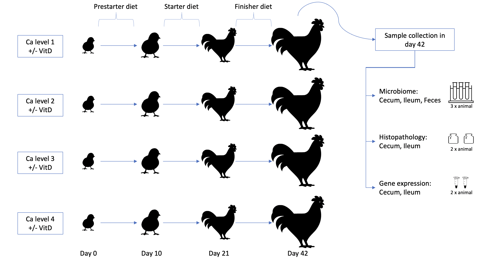
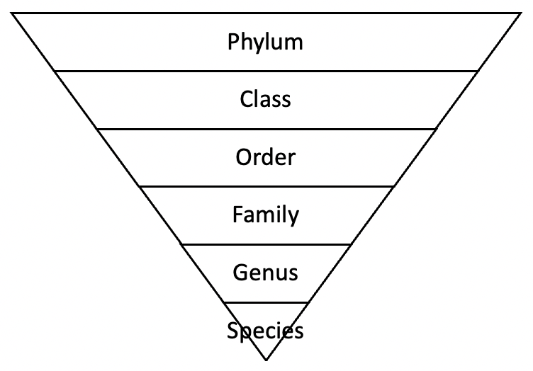

```{r setup, include=FALSE}
knitr::opts_chunk$set(echo = TRUE)
```

```{r libraries, include=FALSE, cache=TRUE}
###load libraries panels tabs####
library(phyloseq) #
library(DESeq2) #
library(kableExtra) #
library(genefilter) #
library(microbiome) #
library(ggplot2)  #
library(vegan) #
library(ggpubr) #
library(ggplot2) #
library(plyr)
library(multcompView)

#####Load libraries correlations####
library(ggplot2)
library(phyloseq)
library(stringr)
library(dplyr)

#####Load libraries LR####
library(tidyverse)
library(ape)
library(ggpubr)

####Load libraries categorical histo####
library(kableExtra)
library(plyr)
library("fantaxtic")
library(data.table)

####load libraries Ratios-histo boxplots####
library(multcompView)
library(reshape)

### OTRICAS
library(plotly)
library(plyr)
library(flexdashboard)
library(shiny)
library(DT)
library(stringr)

## FUNCTIONS
source("/Volumes/GoogleDrive/Mi unidad/SIWAproject/Methods-review/functions.R")

```

```{r All inputs MARIA, include=FALSE,eval = FALSE}
#open phyloseq object
#folder <- "/Users/mcadavid/Documents/Reports_review/E335_Maria/"
#ODLEPobj <- readRDS(paste0(folder, "phyloseqObject_April11.rds"))

#open data-table
## Data creada con create_full_file_for_correlations_to_analytics - Jupyter Notebook
#complete_sample_table <-read.table(paste0(folder, "performance_histo_ge_ratios_alphadiv_for_correlations.csv"),check.names = FALSE, header=T, sep="\t")
  
#EAFIT surveillance tables (same for all reports)
#species_taxonomy_info <-read.csv(paste0(folder, "species_metabolic_effects.csv"),check.names = FALSE, sep=";")
#genera_taxonomy_info <- read.csv(paste0(folder, "genus_metabolic_effects.csv"), check.names = FALSE, sep=";")
#broad_taxonomy_info <- read.csv(paste0(folder, "broad_groups_metabolic_effects.csv"), check.names = FALSE, sep=";")


#open phyloseq object
ODLEPobj <- readRDS("/Users/mcadavid/Documents/Reports_review/E335_Maria/phyloseqObject_April11.rds")

#open data-table
## Data creada con create_full_file_for_correlations_to_analytics - Jupyter Notebook
complete_sample_table <-read.table("/Users/mcadavid/Documents/Reports_review/E335_Maria/Subset_exp1/Correlations/performance_histo_ge_ratios_alphadiv_for_correlations.csv",check.names = FALSE, header=T, sep="\t")
  
#EAFIT surveillance tables (same for all reports)
species_taxonomy_info <-read.csv(file="/Users/mcadavid/Documents/Reports_review/Metabolic_effects_table_V2/species_metabolic_effects.csv",check.names = FALSE, sep=";")
genera_taxonomy_info <- read.csv(file="/Users/mcadavid/Documents/Reports_review/Metabolic_effects_table_V2/genus_metabolic_effects.csv", check.names = FALSE, sep=";")
broad_taxonomy_info <- read.csv(file="/Users/mcadavid/Documents/Reports_review/Metabolic_effects_table_V2/broad_groups_metabolic_effects.csv", check.names = FALSE, sep=";")

#Deseq outputs
dfs_filtered <- readRDS(file="/Volumes/GoogleDrive/Mi unidad/SIWAproject/Reports/Version1.0/Input_data/dfs_filtered.RData")

```

```{r All inputs DANIELA, include=FALSE}
FOLDER = "/Users/dvarelat/Documents/SIWA/Reports/Version1.0/Input_data/"
#open phyloseq object
ODLEPobj <- readRDS(paste0(FOLDER, "phyloseqObject_April11.rds"))

#open data-table
## Data creada con create_full_file_for_correlations_to_analytics - Jupyter Notebook
complete_sample_table <-read.table(paste0(FOLDER, "performance_histo_ge_ratios_alphadiv_for_correlations.csv"),check.names = FALSE, header=T, sep="\t")
  
#EAFIT surveillance tables (same for all reports)
species_taxonomy_info <-read.csv(file=paste0(FOLDER, "species_metabolic_effects.csv") ,check.names = FALSE, sep=";")
genera_taxonomy_info <- read.csv(file=paste0(FOLDER,"genus_metabolic_effects.csv"), check.names = FALSE, sep=";")
broad_taxonomy_info <- read.csv(file=paste0(FOLDER, "broad_groups_metabolic_effects.csv"), check.names = FALSE, sep=";")

#Deseq outputs
dfs_filtered <- readRDS(file=paste0(FOLDER, "dfs_filtered.RData"))

```

Project description {data-icon="fa-table"}
===================================== 

Row {data-height=50}
-----------------------------------------------------------------------

Row
-----------------------------------------------------------------------

### {data-width=200}

Project E335 was an experimental trial done at Iluma's broiler experimental farm located in the town of Fredonia, Antioquia (Colombia) at 1800m above sea level and an average annual temperature of 20º C. It aimed to evaluate the broilers' microbiome, gene expression and gut histology response to different Calcium and VitD levels in the broiler's diet.

The experiment consisted of 8 treatments differing in Ca concentration across the growth stages and also including presence or absence of VitD in the diet. 

Microbiome, gut histology and gene expression data were collected from animals at 33 days of age, following treatment from day of hatch. For microbiome samples, gut content was collected from three different sampling locations: Cecum(C), Ileum(I) and Feces(F). For gene expression and histology samples, tissue samples were collected from two sampling locations: Cecum and Ileum (refer to diagram).


### {data-with=800}
```{r picture, include= TRUE, echo=FALSE, out.width = '100%'}

```


# Exploration {data-navmenu="Microbiome"}

```{r Explore and filter Phyloseq Object, include=FALSE}

#Explore Phylosec object....
<<<<<<< HEAD
### OJO -->> REEMPLAZAR VitD NAME
sample_data(ODLEPobj)$Treatment <- as.factor(stringr::str_replace(sample_data(ODLEPobj)$Treatment, "AlphaD3","VitD"))

=======
### OJO -->> REEMPLAZAR VitD NAME to send reports to externos
sample_data(ODLEPobj)$Treatment <- as.factor(stringr::str_replace(sample_data(ODLEPobj)$Treatment, "MediumAlphaD3","VitD"))
>>>>>>> dd73f96090e95e26cc11c8229d07cf5ebb91a7d5
sample_data(ODLEPobj)$VitDLevel <- as.factor(sample_data(ODLEPobj)$Alphalevel)
sample_data(ODLEPobj)$VitDLevel_label <- as.factor(sample_data(ODLEPobj)$Alphad3level)

#Subset phyloseq object to include only wanted treatments 
ODLEPobj <- subset_samples(ODLEPobj, TreatmentNumber%in%c("1","2","3","4","5","6","7","8"))
ODLEPobj <- subset_samples(ODLEPobj, SampleID != "0074_02C-M") #REMOVE OUTLIAR
metadata <- meta(ODLEPobj)

#Filter phyloseq object by location 
ODLEPobj_cecum<-subset_samples(ODLEPobj, SampleLocation=="C")
ODLEPobj_ileum<-subset_samples(ODLEPobj, SampleLocation=="I")
ODLEPobj_feces<-subset_samples(ODLEPobj, SampleLocation=="F")

```

Row {data-height=50}
-----------------------------------------------------------------------

Row {data-height=30}
-----------------------------------------------------------------------
**Microbiome exploration**

Row
-----------------------------------------------------------------------

### {data-width=150}

As seen in Table 1, six microbiome samples per treatment were collected in each gut location (n=6). Four samples are excluded or missing. 

### TABLE 1: Samples per group {data-width=850}

```{r Table for number of samples per treatment, echo=FALSE, fig.width = 10}
cec = table(subset(as.data.frame(as.matrix(sample_data(ODLEPobj_cecum))), select = c("Treatment")))
ile = table(subset(as.data.frame(as.matrix(sample_data(ODLEPobj_ileum))), select = c( "Treatment")))
fec = table(subset(as.data.frame(as.matrix(sample_data(ODLEPobj_feces))), select = c("Treatment")))

tab=rbind(ile,cec,fec)
tab <- as.data.frame(t(tab))
colnames(tab)=c("Ileum","Cecum","Feces")
<<<<<<< HEAD
l <- list("LowCa",
"LowCa+MediumVitD",
"MediumLowCa",
"MediumLowCa+MediumVitD",
"MediumHighCa",
"MediumHighCa+MediumVitD",
"HighCa",
"HighCa+MediumVitD")

tab <- tab[order(match(rownames(tab), l)),]
kbl(tab, centering = FALSE) %>% 
  kable_styling(full_width = F, position = "center")  %>%
   column_spec(2, color = spec_color(tab$Ileum, end=0.5)) %>%
   column_spec(3, color = spec_color(tab$Cecum, end=0.5)) %>%
   column_spec(4, color = spec_color(tab$Feces, end=0.5)) 
=======

l <- list("LowCa",
"LowCa+VitD",
"MediumLowCa",
"MediumLowCa+VitD",
"MediumHighCa",
"MediumHighCa+VitD",
"HighCa",
"HighCa+VitD")

tab <- tab[order(match(rownames(tab), l)),]
ttab <-as.data.frame(t(tab))
kbl(ttab, centering = FALSE) %>% 
  kable_styling(full_width = F, position = "center") # %>%
   #column_spec(2, color = spec_color(ttab$"LowCa", end = 0.5, direction= -1, option= "magma")) %>%
   #column_spec(3, color = spec_color(ttab$"LowCa+VitD",end = 0.5, direction= -1, option= "magma")) %>%
   #column_spec(4, color = spec_color(ttab$"MediumLowCa", end = 0.5, direction= -1, option= "magma")) %>%
   #column_spec(5, color = spec_color(ttab$"MediumLowCa+VitD", end = 0.5, direction= -1, option= "magma")) %>%
   #column_spec(6, color = spec_color(ttab$"MediumHighCa", end = 0.5, direction= -1, option= "magma")) %>%
   #column_spec(7, color = spec_color(ttab$"MediumHighCa+VitD", end = 0.5, direction= -1, option= "magma")) %>%
   #column_spec(8, color = spec_color(ttab$"HighCa", end = 0.5, direction= -1, option= "magma")) %>%
   #column_spec(9, color = spec_color(ttab$"HighCa+VitD", end = 0.5, direction= -1, option= "magma")) 
>>>>>>> dd73f96090e95e26cc11c8229d07cf5ebb91a7d5

rownames(tab)


 
```

Row {data-height=120}
-----------------------------------------------------------------------
Sequences identified during the sequencing process are grouped in batches of identical sequences so that the number of times that sequences was found can be recorded. This is the abundance of the sequence. The groups of identical sequences are called Operational Taxonomic Units 
<a href="https://en.wikipedia.org/wiki/Operational_taxonomic_unit" target="_blank">(OTUs)</a> or Amplicon Sequence Variants <a href="https://en.wikipedia.org/wiki/Amplicon_sequence_variant" target="_blank">(ASVs)</a>, and they often (but not always) correspond to species or genera of bacteria. In the Figure 1 we can observe the prevalence of OTUs across all samples (the fixed threshold for an OTU to be considered present in a sample is 0.1% relative abundance). 

Row {data-height=500}
-----------------------------------------------------------------------
### {data-width=300}

The sequencing process identified more than 1300 unique sequences, and as expected, only a few OTUs are shared by the majority of samples (Fig1). Black percentages in each graph (Fig1) indicate the percentage of OTUs in that site that are present in at least 50% of the samples. As seen in the graph, most are rare taxa detected in only a small portion of samples. It is common to find a small number of OTUs which are dominant in the community, while most others are much less abundant and they are unlikely to be biologically related to any performance or treatment-based effects. Only 3% of OTUs in the feces are shared by more than 50% of samples, while in the cecum this number is 11%. This means that cecal samples tend to have more microbes in common than fecal samples. 

### FIGURE 1:Prevalence of OTUs in samples. <br/> Regardless of treatment or group, a small number of OTUs dominate the community, and most OTUs are only present in a small number of samples. {data-width=700}
```{r Prevalence Plot, fig.height = 4, fig.width= 5, echo=FALSE}

#OPTIONAL: OTUs of interest to highlight in the plot (add to the list the otu or otus of interest you want to highlight in the plot)
otus_of_interest= list()

#Ileum 
pseq.rel_ileum <- microbiome::transform(ODLEPobj_ileum, "compositional")
otu_relative_ileum <- as.data.frame(otu_table(pseq.rel_ileum))
#colSums(otu_relative_ileum) #Check if normalized: sum relative abundance added should be one 

#remove OTUs that are zero in all samples
otu_relative_ileum = otu_relative_ileum[!apply(otu_relative_ileum, 1, function(x) all(x == 0)), ]
total_samples= ncol(otu_relative_ileum) 
total_otus= nrow(otu_relative_ileum) 

#absent in how many samples?
absent=apply(otu_relative_ileum ==0, 1, sum)  #podria cambiarlo por un threshold para considerar absent una OTU en una muestra <0.001
#add a col with the percentage of samples it is present
otu_relative_ileum$percentage_samples_present=(1-(absent/total_samples))*100 
#add a col with OTU names
otu_relative_ileum$OTU <- row.names(otu_relative_ileum)
#add otus of interest to highlight in the plot
otu_relative_ileum$of_interest <- ifelse(otu_relative_ileum$OTU %in% otus_of_interest == TRUE, "YES", "NO")

#plot
colors <- c("#343aeb","#f56342")
sizes <- c(0.05, 4)
prev_plot_ileum=ggplot(data = otu_relative_ileum) +
  theme_classic()+
  aes(x = reorder(OTU,-percentage_samples_present,sum), y =percentage_samples_present, color=of_interest, size=of_interest) +
  geom_point() +
  scale_colour_manual(values=colors) + 
  scale_size_manual (values=sizes)+
  #geom_point(color="#343aeb", size=0.05) +
  ggtitle("Ileum") +
  #xlab("OTU") + ylab("samples where OTU is present (%)")+
  theme(legend.position = "none",
        axis.text.x=element_blank(),
        axis.ticks.x=element_blank(),
        axis.title.x=element_blank(),
        axis.title.y=element_blank())


#Feces
pseq.rel_feces <- microbiome::transform(ODLEPobj_feces, "compositional")
otu_relative_feces <- as.data.frame(otu_table(pseq.rel_feces))
#colSums(otu_relative_feces) #Check if normalized: sum relative abundance added should be one 

#remove OTUs that are zero in all samples
otu_relative_feces = otu_relative_feces[!apply(otu_relative_feces, 1, function(x) all(x == 0)), ]
total_samples= ncol(otu_relative_feces) 
total_otus= nrow(otu_relative_feces) 

#absent in how many samples?
absent=apply(otu_relative_feces ==0, 1, sum)  #podria cambiarlo por un threshold para considerar absent una OTU en una muestra <0.001
#add a col with the percentage of samples it is present
otu_relative_feces$percentage_samples_present=(1-(absent/total_samples))*100 
#add a col with OTU names
otu_relative_feces$OTU <- row.names(otu_relative_feces)
#add otus of interest to highlight in the plot
otu_relative_feces$of_interest <- ifelse(otu_relative_feces$OTU %in% otus_of_interest == TRUE, "YES", "NO")

#plot
colors <- c("#16DCC9","#f56342")
sizes <- c(0.05, 4)
prev_plot_feces=ggplot(data = otu_relative_feces) +
  theme_classic()+
  aes(x = reorder(OTU,-percentage_samples_present,sum), y =percentage_samples_present, color=of_interest, size=of_interest) +
  geom_point() +
  scale_colour_manual(values=colors) + 
  scale_size_manual (values=sizes)+
  #geom_point(color="#16DCC9", size= 0.05) +
  ggtitle("Feces") +
  #xlab("OTU") + ylab("samples where OTU is present (%)")+
  theme(legend.position = "none",
        axis.text.x=element_blank(),
        axis.ticks.x=element_blank(),
        axis.title.x=element_blank(),
        axis.title.y=element_blank())


#Cecum 
pseq.rel_cecum <- microbiome::transform(ODLEPobj_cecum, "compositional")
otu_relative_cecum <- as.data.frame(otu_table(pseq.rel_cecum))
#colSums(otu_relative_cecum) #Check if normalized: sum relative abundance added should be one 

#remove OTUs that are zero in all samples
otu_relative_cecum = otu_relative_cecum[!apply(otu_relative_cecum, 1, function(x) all(x == 0)), ]
total_samples= ncol(otu_relative_cecum) 
total_otus= nrow(otu_relative_cecum) 

#absent in how many samples?
absent=apply(otu_relative_cecum ==0, 1, sum)  #podria cambiarlo por un threshold para considerar absent una OTU en una muestra <0.001
#add a col with the percentage of samples it is present
otu_relative_cecum$percentage_samples_present=(1-(absent/total_samples))*100 
#add a col with OTU names
otu_relative_cecum$OTU <- row.names(otu_relative_cecum)
#add otus of interest to highlight in the plot
otu_relative_cecum$of_interest <- ifelse(otu_relative_cecum$OTU %in% otus_of_interest == TRUE, "YES", "NO")

#plot
colors <- c("#BA4FC8","#f56342")
sizes <- c(0.05, 4)
prev_plot_cecum=ggplot(data = otu_relative_cecum) +
  theme_classic()+
  aes(x = reorder(OTU,-percentage_samples_present,sum), y =percentage_samples_present, color=of_interest,   size=of_interest) +
  geom_point() +
  scale_colour_manual(values=colors) + 
  scale_size_manual (values=sizes)+
  #geom_point(color="#BA4FC8", size=0.05) +
  ggtitle("Cecum") +
  #xlab("OTU") + ylab("samples where OTU is present (%)")+
  theme(legend.position = "none",
        axis.text.x=element_blank(),
        axis.ticks.x=element_blank(),
        axis.title.x=element_blank(),
        axis.title.y=element_blank())


##  Add dased line to each plot
#ileum 
otu_relative_ileum_more_50 = otu_relative_ileum[otu_relative_ileum$percentage_samples_present >= 50, c("OTU", "percentage_samples_present")]
more50_ileum = dim(otu_relative_ileum_more_50)[1]
prev_plot_ileum = prev_plot_ileum + geom_segment(aes(x=0, y=50, xend=more50_ileum, yend=50), linetype="dashed", color="black")
prev_plot_ileum = prev_plot_ileum + geom_segment(aes(x=more50_ileum, y=0, xend=more50_ileum, yend=50), linetype="dashed", color="black")
prev_plot_ileum= prev_plot_ileum + annotate("text", x = more50_ileum, y = 50, label = paste0("                        ", round(more50_ileum/dim(otu_relative_ileum)[1] * 100, 1), "% OTUs"))

#cecum
otu_relative_cecum_more_50 = otu_relative_cecum[otu_relative_cecum$percentage_samples_present >= 50, c("OTU", "percentage_samples_present")]
more50_cecum = dim(otu_relative_cecum_more_50)[1]
prev_plot_cecum = prev_plot_cecum + geom_segment(aes(x=0, y=50, xend=more50_cecum, yend=50), linetype="dashed", color="black")
prev_plot_cecum = prev_plot_cecum + geom_segment(aes(x=more50_cecum, y=0, xend=more50_cecum, yend=50), linetype="dashed", color="black")
prev_plot_cecum= prev_plot_cecum + annotate("text", x = more50_cecum, y = 50, label = paste0("                        ", round(more50_cecum/dim(otu_relative_cecum)[1] * 100, 1), "% OTUs"))

#feces
otu_relative_feces_more_50 = otu_relative_feces[otu_relative_feces$percentage_samples_present >= 50, c("OTU", "percentage_samples_present")]
more50_feces = dim(otu_relative_feces_more_50)[1]
prev_plot_feces = prev_plot_feces + geom_segment(aes(x=0, y=50, xend=more50_feces, yend=50), linetype="dashed", color="black")
prev_plot_feces = prev_plot_feces + geom_segment(aes(x=more50_feces, y=0, xend=more50_feces, yend=50), linetype="dashed", color="black")
prev_plot_feces= prev_plot_feces + annotate("text", x = more50_feces, y = 50, label = paste0("                        ", round(more50_feces/dim(otu_relative_feces)[1] * 100, 1), "% OTUs"))


#Aggregted figure (3 locations prevalence graph)

figure <- ggarrange( prev_plot_cecum, prev_plot_ileum , prev_plot_feces, 
                    ncol = 1, nrow = 3,
                    font.label = list(size = 10, color = "black", face = "plain"))
annotate_figure(figure,
                bottom = text_grob("OTUs in order of prevalence"), 
                left = text_grob("Samples in which OTU is present (%)", rot=90)) 
```

Row {data-height=150}
-----------------------------------------------------------------------
### {data-width=600}

After filtering low-abundance sequences, the remaining data can be explored more easily. Exploring the distribution of sequences at different taxonomic levels can help us understand the general microbiome composition of the samples in the experiment as a whole.  

###  {data-width=400}

```{r picture ranges, include= TRUE, echo=FALSE, out.width = '100%'}

```


Row {data-height=500}
-----------------------------------------------------------------------
### {data-width=200} 

In Figure 2 we can observe the prevalence and abundance of the OTUs at phylum level. Each point is a different OTU, prevalence in Y axis is the proportion of samples in which each OTU is present. The x axis is the abundance in which each OTU is found. Each dot represents an OTU. 

### FIGURE 2: Prevalence of Major Phyla. <br/> Firmicutes have a larger share of the overall community than any other phylum.  The most abundant OTUs (x axis) also tend to be the most prevalent (y axis). {data-width=800}
```{r Prevalence Phylum, echo=FALSE, include=TRUE, cache=TRUE}
pseq.rel <- microbiome::transform(ODLEPobj, "compositional")
flist    <- filterfun(kOverA(5, 2e-05))
ODLEPobjRelFilter =  filter_taxa(pseq.rel, flist, TRUE)
p <- plot_taxa_prevalence(ODLEPobjRelFilter, "Phylum")
p <- p + theme(legend.position='none')
ggplotly(p) %>% 
 layout( 
 xaxis = list(automargin=TRUE), 
 yaxis = list(automargin=TRUE)
 ) %>% 
  style(hoverinfo = 'none') %>% partial_bundle() 


```


Row {data-height=550}
-----------------------------------------------------------------------
### {data-width=200}

Next, we observe the distribution of taxa at the family level but incorporating location and treatment.  

Distribution can be understood using relative abundance, which is the proportion of a taxon relative to all other taxons in the same sample. It is presented as a proportion of 1 or a percentage.

It can be seen in Figure 3, where each dot represents a sample, that while the  location has a strong impact on distribution, treatment does not affect the distribution of the families at first sight.

### FIGURE 3: Family distribution by sample locations: Cecum(C), Ileum(I), Feces(F) {data-width=800}
```{r Family distribution, echo=FALSE}
#Family ditribution
ps.com.fam <- microbiomeutilities::aggregate_top_taxa2(ODLEPobjRelFilter,top = 8, "Family" )

ps_df <- microbiomeutilities::phy_to_ldf(ps.com.fam, transform.counts = "compositional")
plotfam <- ggstripchart(ps_df, "SampleLocation", "Abundance", 
             facet.by = "Family", color = "Treatment", 
             #size = 5,
             ylab= "Relative abundances")

p<- ggpar(plotfam,legend = "right") #+ theme(text=element_text(size=25)) 

ggplotly(p) %>% 
 layout( 
 xaxis = list(automargin=TRUE), 
 yaxis = list(automargin=TRUE)
 ) %>% 
  style(hoverinfo = 'none') %>% partial_bundle()

```


# Taxonomic composition {data-navmenu="Microbiome"}
Row {data-height=50}
-----------------------------------------------------------------------

Row {data-height=30}
-----------------------------------------------------------------------
**Microbiome taxonomic composition**

Row {data-height=50}
-----------------------------------------------------------------------
In the following interactive graphs we can view the main **genera** present in the treatments at each location. 

```{r  Taxonomic composition , include=FALSE, warning=FALSE}
#####Plot Taxonomic composition feces#####  
#Aggregate OTUs according to genus 
ODLEPobj_cecum_glom <- tax_glom(ODLEPobj_cecum, taxrank="Genus", NArm=FALSE)
#create dataframe from phyloseq object
subset.genus.df <- psmelt(ODLEPobj_cecum_glom) 
subset.genus.df$genus <- as.character(subset.genus.df$Genus) #convert to character
#calculate median rel. abundance
medians <- ddply(subset.genus.df, ~genus, function(x) c(median=median(x$Abundance)))
#calculate remainder
remainder <- medians[medians$median <= 0.01,]$genus
subset.genus.df[subset.genus.df$genus %in% remainder,]$genus <- "Genera < 1% abund."

#Figures abundances
subset.genus.df <- subset.genus.df %>%
  mutate( Treatment=factor(Treatment,levels=c("LowCa", "LowCa+VitD", "MediumLowCa", "MediumLowCa+VitD", "MediumHighCa", "MediumHighCa+VitD", "HighCa","HighCa+VitD")) )
#plot with condensed genera into "< 1% abund" category by Treatment
plot_abundance_cecum<- ggplot(subset.genus.df, aes(x = Treatment, y = Abundance, fill = genus)) +
  geom_bar(stat="identity", position="fill") + 
  xlab("Treatment") +
  ylab("Relative abundance")+
  labs(fill="Genera") +
  #stat_compare_means(method = "anova")+ 
  theme(axis.text.x = element_text(angle = 60, hjust = 1))+
  theme(text=element_text(size=12)) 


#####Plot Taxonomic composition ileum#####  
#Aggregate OTUs according to genus 
ODLEPobj_ileum_glom = tax_glom(ODLEPobj_ileum, taxrank="Genus", NArm=FALSE)
#create dataframe from phyloseq object
subset.genus.df <- psmelt(ODLEPobj_ileum_glom) 
subset.genus.df$genus <- as.character(subset.genus.df$Genus) #convert to character
#calculate median rel. abundance
medians <- ddply(subset.genus.df, ~genus, function(x) c(median=median(x$Abundance)))
#calculate remainder
remainder <- medians[medians$median <= 0.01,]$genus
subset.genus.df[subset.genus.df$genus %in% remainder,]$genus <- "Genera < 1% abund."

#Figures abundances
subset.genus.df <- subset.genus.df %>%
  mutate( Treatment=factor(Treatment,levels=c("LowCa", "LowCa+VitD", "MediumLowCa", "MediumLowCa+VitD", "MediumHighCa", "MediumHighCa+VitD", "HighCa","HighCa+VitD")) )
#plot with condensed genera into "< 1% abund" category by Treatment
p <- ggplot(data=subset.genus.df, aes(x=reorder(Treatment, KitID), y=Abundance ,fill=genus))
plot_abundance_ileum<- p + geom_bar(stat="identity", position="fill") + 
  xlab("Treatment") +
  ylab("Relative abundance")+
  labs(fill="Genera") +
  #stat_compare_means(method = "anova")+ 
  theme(axis.text.x = element_text(angle = 60, hjust = 1))+
  theme(text=element_text(size=12)) 


#####Plot Taxonomic composition feces#####  
#Aggregate OTUs according to genus 
ODLEPobj_feces_glom = tax_glom(ODLEPobj_feces, taxrank="Genus", NArm=FALSE)
#create dataframe from phyloseq object
subset.genus.df <- psmelt(ODLEPobj_feces_glom) 
subset.genus.df$genus <- as.character(subset.genus.df$Genus) #convert to character
#calculate median rel. abundance
medians <- ddply(subset.genus.df, ~genus, function(x) c(median=median(x$Abundance)))
#calculate remainder
remainder <- medians[medians$median <= 0.01,]$genus
subset.genus.df[subset.genus.df$genus %in% remainder,]$genus <- "Genera < 1% abund."

#Figures abundances
subset.genus.df <- subset.genus.df %>%
  mutate( Treatment=factor(Treatment,levels=c("LowCa", "LowCa+VitD", "MediumLowCa", "MediumLowCa+VitD", "MediumHighCa", "MediumHighCa+VitD", "HighCa","HighCa+VitD")) )
#plot with condensed genera into "< 1% abund" category by Treatment
p <- ggplot(data=subset.genus.df, aes(x=Treatment, y=Abundance ,fill=genus))
plot_abundance_feces<- p + geom_bar(stat="identity", position="fill") + 
  xlab("Treatment") +
  ylab("Relative abundance")+
  labs(fill="Genera") +
  #stat_compare_means(method = "anova")+ 
  theme(axis.text.x = element_text(angle = 60, hjust = 1))+
  theme(text=element_text(size=12)) 

```

Row {data-height=500}
-----------------------------------------------------------------------
### FIGURE 4A: Taxonomic composition Cecum. <br/> The experimental groups are overall quite similar in their microbial composition, with some differences in abundance of Lactobacillus and Subdoligranulum to name just two.{data-width=1000}
```{r, echo=FALSE, include=TRUE}

ggplotly(plot_abundance_cecum) %>%
  layout(xaxis = list(automargin = TRUE),
         yaxis = list(automargin = TRUE)) %>%
  style(hoverinfo = 'none') %>% partial_bundle()

#ggplotly(plot_abundance_cecum) %>% partial_bundle()
```

Row {data-height=500}
-----------------------------------------------------------------------
### FIGURE 4B: Taxonomic composition Ileum. <br/> Lactobacillus is the dominant microbe in the ileum, and varies between 60-80% depending on the group. {data-width=1000}
```{r, echo=FALSE, include=TRUE}
ggplotly(plot_abundance_ileum) %>%
  layout(xaxis = list(automargin = TRUE),
         yaxis = list(automargin = TRUE)) %>%
  style(hoverinfo = 'none') %>% partial_bundle()
```

Row {data-height=500}
-----------------------------------------------------------------------
### FIGURE 4C: Taxonomic composition Feces. <br/> The feces look very similar to the ileum, but with more variability. {data-width=1000}
```{r, echo=FALSE, include=TRUE}
ggplotly(plot_abundance_feces) %>%
  layout(xaxis = list(automargin = TRUE),
         yaxis = list(automargin = TRUE)) %>%
  style(hoverinfo = 'none') %>% partial_bundle()
```


# Diversity {data-navmenu="Microbiome"}

Row {data-height=50}
-----------------------------------------------------------------------

Row {data-height=30}
-----------------------------------------------------------------------
**Microbiome diversity**

Row {data-height=50}
-----------------------------------------------------------------------
Then, we went on to evaluate diversity in the microbiome samples. Microbiome diversity can be assessed through multiple ecological indices that can be divided into two kinds of measures, alpha and beta diversity. <a href="https://en.wikipedia.org/wiki/Alpha_diversity" target="_blank">Alpha diversity</a> measures the variability of species within a sample while <a href="https://en.wikipedia.org/wiki/Beta_diversity" target="_blank">beta diversity</a> accounts for the differences in composition between samples.

Row {data-height=50}
-----------------------------------------------------------------------

Row {data-height=30}
-----------------------------------------------------------------------
**Alpha diversity**

Row {data-height=30}
-----------------------------------------------------------------------
*Richness* = This index represents the observed OTUs or features in the sample.

Row {data-height=50}
-----------------------------------------------------------------------
*Shannon diversity* = This index measures the homogeneity in abundance of the different OTUs in a sample. In other words, shannon index is an estimate of how complex the community is.


Row {data-height=500}
-----------------------------------------------------------------------
### {data-width=350}
Alpha diversity analyses showed a higher diversity for Cecum compared to the other gut locations, larger microbiome alpha diversity being usually associated to better health status. However, it is also normal for each region of the gut to have different ranges of richness/diversity. The **cecal microbiome** tends to be very rich, while the small intestines and Feces usually have a smaller number of bacterial species. 

Further alpha diversity analyses showed a few differences between treatment groups within the Cecum samples and within the Ileum samples. In the fecal samples there were no differences between treatments regardless of the index used. This is not uncommon; many changes in microbial diversity occur at the level of abundance, rather than richness. In other words, the types of bacteria present in a community may not change very much, but abundances of individual groups of bacteria can shift, generating changes in the ecosystem and representing the real differences between treatments. And this can not always be captured using alpha diversity calculations.

### FIGURE 5: Alpha diversity grouped by sample location: Cecum(C), Ileum(I), Feces(F). <br/> The cecum has higher richness and diversity than the ileum and feces, and the feces have outlier samples that look more like the cecum. {data-width=650}

```{r , echo=FALSE}
#alpha diversity comparing locations
pdiv <- plot_anova_diversity_edit(ODLEPobj, method = c("richness", "shannon"),
                                  grouping_column =  "SampleLocation", pValueCutoff=0.05) + 
                                  xlab(NULL) + ylab(NULL) + theme(legend.position = "none")

pdiv
```


Row {data-height=400}
-----------------------------------------------------------------------
### FIGURE 6A: Cecum diversity. <br/> There is variability in group-specific diversity within the cecum, but no clear pattern based on treatment.

```{r , echo=FALSE}
#Alpha diversity with ANOVA separated by location 

#Cecum 
pc <-plot_anova_diversity_edit(ODLEPobj_cecum, method = c("richness", "shannon"), 
                          grouping_column ="Treatment", 
                          pValueCutoff=0.05)+ xlab(NULL)+ ylab(NULL)+ 
                          theme(axis.text.x=element_blank(), axis.ticks.x=element_blank()) +theme(legend.position = "bottom",
                          axis.title.y=element_text(angle = 0, vjust = .5, size = 12)) +
                          theme(text=element_text(size=10))
pc
```


### FIGURE 6B: Ileum diversity. <br/> The MediumHigh + VitD group had higher richness than some other groups, but no clear pattern is indicated. Richness may increase with increasing Ca levels, but only to the MediumHigh level before falling in the High Ca group.

```{r , echo=FALSE}

#ileum
pi <- plot_anova_diversity_edit(ODLEPobj_ileum, method = c("richness", "shannon"), 
                          grouping_column ="Treatment", 
                          pValueCutoff=0.05)+ xlab(NULL)+ ylab(NULL)+ 
                          theme(axis.text.x=element_blank(), axis.ticks.x=element_blank()) +
                          theme(legend.position = "bottom",
                          axis.title.y=element_text(angle = 0, vjust = .5, size = 12)) +
                          theme(text=element_text(size=10))
#ggplotly(pi) %>% partial_bundle()
pi
```

### FIGURE 6C: Feces diversity. <br/> No clear pattern in richness or diversity between groups is indicated in the feces.

```{r , echo=FALSE}
#feces
pf <-plot_anova_diversity_edit(ODLEPobj_feces, method = c("richness", "shannon"), 
                          grouping_column ="Treatment", 
                          pValueCutoff=0.05)+ xlab(NULL)+ ylab(NULL)+ 
                          theme(axis.text.x=element_blank(), axis.ticks.x=element_blank()) +
                          theme(legend.position = "bottom",
                          axis.title.y=element_text(angle = 0, vjust = .5, size = 12)) +
                          theme(text=element_text(size=10))
#ggplotly(pf) %>% partial_bundle()
pf
```

Row {data-height=50}
-----------------------------------------------------------------------

Row {data-height=30}
-----------------------------------------------------------------------
**Beta diversity**

Row {data-height=500}
-----------------------------------------------------------------------
### {data-width=350}
Hence, we went on to evaluate those differences in bacterial abundances between the samples, this is also known as beta diversity or **"compositional"** distance. These distances (In our case Bray Curtis dissimilarities) are often visualized with a method called **principal coordinates analysis (PCoA)**. Each axis represents a combination of features (OTUs) that account for high amounts of variation between samples.  The percentage of the differences for which this combination of features accounts is shown on the axis. Each dot in the figure is a sample. Samples that are on opposite ends of an axis that accounts for a high percentage of variability are likely to be more different than samples that are on opposite ends of an axis that only accounts for low percentage of the total variability.

These analyses evidenced clear differentiation between samples of different gut locations (pval=0.001), which was biologically expected since different locations of the gut have different dynamics, roles and environmental conditions.

```{r , include=FALSE}
bray.dist <- phyloseq::distance(ODLEPobj, method = "bray")
metadata <- as(sample_data(ODLEPobj), "data.frame")

out.bray <- ordinate(ODLEPobj, method = "MDS", distance = "bray") 
beta.bray = plot_ordination(ODLEPobj, out.bray, color="SampleLocation" )  
group_location <- c("Cecal","Fecal", "Ileum") 
colores <- c("#BA4FC8","#16DCC9", "#343aeb")

plot.beta.bray <- beta.bray + geom_point(size=4, alpha=0.75, na.rm=T) +  #sobreponer un punto mas grande 
  scale_colour_manual(values=colores, labels = group_location) + #cambiar colores y poner nombre a cada grupo en leyenda
  theme(axis.text.x = element_blank(), axis.text.y = element_blank(), axis.ticks = element_blank())

```

### FIGURE 7: Dissimilarity between all samples (Bray distances). <br/> The cecum is distinct from the ileum and feces, while ileal and fecal samples are more variable, and more overlapping. {data-width=650}
```{r , echo=FALSE}
plot.beta.bray
```

Row {data-height=50}
-----------------------------------------------------------------------
Despite the fact that the differences are not always apparent in the PCoAs, statistical significant differences were also found between the treatments within each location, including significance by Calcium level and by VitD level.

Row {data-height=30}
-----------------------------------------------------------------------

**By Treatment:**

Row {data-height=500}
-----------------------------------------------------------------------
```{r, include=FALSE}
#####Betadiverisity Bray Cecum#####
bray.dist <- phyloseq::distance(ODLEPobj_cecum, method = "bray")
metadata <- as(sample_data(ODLEPobj_cecum), "data.frame")

out.bray <- ordinate(ODLEPobj_cecum, method = "MDS", distance = "bray") 
beta.bray <- plot_ordination(ODLEPobj_cecum, out.bray, color="Treatment", axes=c(1, 2))  

plot.beta.bray.cecum <- beta.bray + geom_point(size=4, alpha=0.75, na.rm=T) + 
  labs(col= "Treatment") + theme(axis.text.x = element_blank(), axis.text.y = element_blank(), axis.ticks = element_blank(), 
        legend.position="bottom")


#####Betadiverisity Bray Ileum#####
bray.dist <- phyloseq::distance(ODLEPobj_ileum, method = "bray")

out.bray <- ordinate(ODLEPobj_ileum, method = "MDS", distance = "bray") 
beta.bray = plot_ordination(ODLEPobj_ileum, out.bray, color="Treatment")  

plot.beta.bray.ileum <- beta.bray + geom_point(size=4, alpha=0.75, na.rm=T) +  #sobreponer un punto mas grande 
  labs(col= "Treatment") +  #titulo de la grafica y de la leyenda
  theme(axis.text.x = element_blank(), axis.text.y = element_blank(), axis.ticks = element_blank(), legend.position="bottom")

#####Betadiverisity Bray Feces#####
bray.dist <- phyloseq::distance(ODLEPobj_feces, method = "bray")

out.bray <- ordinate(ODLEPobj_feces, method = "MDS", distance = "bray") 
beta.bray <- plot_ordination(ODLEPobj_feces, out.bray, color="Treatment")  

plot.beta.bray.feces <- beta.bray + geom_point(size=4, alpha=0.75, na.rm=T) +  #sobreponer un punto mas grande 
  labs(col= "Treatment") +  #titulo de la grafica y de la leyenda
  theme(axis.text.x = element_blank(), axis.text.y = element_blank(), axis.ticks = element_blank(), legend.position="bottom")


```

### FIGURE 8A: Beta diversity Cecum (Treatment). <br/> The experimental groups do not cluster clearly when all treatment levels are included.

```{r , echo=FALSE}
plot.beta.bray.cecum
```

### FIGURE 8B: Beta diversity Ileum (Treatment). <br/> The experimental groups do not cluster clearly when all treatment levels are included.
```{r , echo=FALSE}
plot.beta.bray.ileum
```

### FIGURE 8C:Beta diversity Feces (Treatment). <br/> The experimental groups do not cluster clearly when all treatment levels are included.

```{r , echo=FALSE}
plot.beta.bray.feces
```

Row {data-height=30}
-----------------------------------------------------------------------

**By Calcium level:**

Row {data-height=500}
-----------------------------------------------------------------------

```{r, include=FALSE}
#####Betadiverisity Bray Cecum#####
out.bray <- ordinate(ODLEPobj_cecum, method = "MDS", distance = "bray") 
beta.bray = plot_ordination(ODLEPobj_cecum, out.bray, color="Calcium_level", axes=c(1, 2))  

plot.beta.bray.cecum<-beta.bray + geom_point(size=4, alpha=0.75, na.rm=T) +  #sobreponer un punto mas grande 
  labs(col= "Calcium_level") +  #titulo de la grafica y de la leyenda
  theme(axis.text.x = element_blank(), axis.ticks = element_blank(), legend.position="bottom")

#####Betadiverisity Bray Ileum#####
out.bray <- ordinate(ODLEPobj_ileum, method = "MDS", distance = "bray") 
beta.bray<-plot_ordination(ODLEPobj_ileum, out.bray, color="Calcium_level")  

plot.beta.bray.ileum<-beta.bray + geom_point(size=4, alpha=0.75, na.rm=T) +  #sobreponer un punto mas grande 
  labs(col= "Calcium_level") +  #titulo de la grafica y de la leyenda
  theme(axis.text.x = element_blank(), axis.ticks = element_blank(), legend.position="bottom")

#####Betadiverisity Bray Feces#####
out.bray <- ordinate(ODLEPobj_feces, method = "MDS", distance = "bray") 
beta.bray<-plot_ordination(ODLEPobj_feces, out.bray, color="Calcium_level")  

plot.beta.bray.feces<-beta.bray + geom_point(size=4, alpha=0.75, na.rm=T) +  #sobreponer un punto mas grande 
  labs( col= "Calcium_level") +  #titulo de la grafica y de la leyenda
  theme(axis.text.x = element_blank(), axis.ticks = element_blank(), legend.position="bottom")

```

### FIGURE 9A: Beta diversity Cecum (Calcium). <br/> The low calcium samples (1) and high calcium samples (4) separate cleanly, while the intermediate groups overlap them.

```{r , echo=FALSE}
ggplotly(plot.beta.bray.cecum)%>%
  layout(xaxis = list(automargin = TRUE),
         yaxis = list(automargin = TRUE)) %>%
  style(hoverinfo = 'none') %>% partial_bundle()
```

### FIGURE 9B: Beta diversity Ileum (Calcium). <br/> There is no clear impact of calcium level on beta diversity in the ileum.
```{r , echo=FALSE}
ggplotly(plot.beta.bray.ileum) %>%
  layout(xaxis = list(automargin = TRUE),
         yaxis = list(automargin = TRUE)) %>%
  style(hoverinfo = 'none') %>% partial_bundle()

```

### FIGURE 9C: Beta diversity Feces (Calcium). <br/> There is no clear impact of calcium level on beta diversity in the feces.

```{r , echo=FALSE}
ggplotly(plot.beta.bray.feces) %>%
  layout(xaxis = list(automargin = TRUE),
         yaxis = list(automargin = TRUE)) %>%
  style(hoverinfo = 'none') %>% partial_bundle()
```

Row {data-height=30}
-----------------------------------------------------------------------

**By VitD level:**

Row {data-height=500}
-----------------------------------------------------------------------
```{r , echo=FALSE}
#####Betadiverisity Bray Cecum#####
#Ordination beta
out.bray <- ordinate(ODLEPobj_cecum, method = "MDS", distance = "bray") 
beta.bray <- plot_ordination(ODLEPobj_cecum, out.bray, color="VitDLevel_label", axes=c(1, 2))  

plot.beta.bray.cecum = beta.bray + geom_point(size=4, alpha=0.75, na.rm=T) +  #sobreponer un punto mas grande 
  labs(col= "VitDLevel") +  #titulo de la grafica y de la leyenda
  theme(axis.text.x = element_blank(), axis.ticks = element_blank(), legend.position="bottom")

#####Betadiverisity Bray Ileum#####
#Ordination beta
out.bray <- ordinate(ODLEPobj_ileum, method = "MDS", distance = "bray") 
beta.bray = plot_ordination(ODLEPobj_ileum, out.bray, color="VitDLevel_label")  

plot.beta.bray.ileum = beta.bray + geom_point(size=4, alpha=0.75, na.rm=T) +  #sobreponer un punto mas grande 
  labs(col= "VitDLevel") +  #titulo de la grafica y de la leyenda
  theme(axis.text.x = element_blank(), axis.ticks = element_blank(), legend.position="bottom")
#plot.beta.bray.ileum

#####Betadiverisity Bray Feces#####
#Ordination beta
out.bray <- ordinate(ODLEPobj_feces, method = "MDS", distance = "bray") 
beta.bray = plot_ordination(ODLEPobj_feces, out.bray, color="VitDLevel_label")  

plot.beta.bray.feces = beta.bray + geom_point(size=4, alpha=0.75, na.rm=T) +  #sobreponer un punto mas grande 
  labs(col= "VitDlevel") +  #titulo de la grafica y de la leyenda
  theme(axis.text.x = element_blank(), axis.ticks = element_blank(), legend.position="bottom")
#plot.beta.bray.feces
```

### FIGURE 10A: Beta diversity Cecum (VitD)

```{r , echo=FALSE}
plot.beta.bray.cecum 
```

### FIGURE 10B: Beta diversity Ileum (VitD)
```{r , echo=FALSE}
plot.beta.bray.ileum
```

### FIGURE 10C: Beta diversity Feces (VitD)

```{r , echo=FALSE}
plot.beta.bray.feces
```


# Differential Abundance {data-navmenu="Microbiome"}


Row {data-height=50}
-----------------------------------------------------------------------

Row {data-height=30}
-----------------------------------------------------------------------
**Microbiome differential abundance analysis**

Row {data-height=100}
-----------------------------------------------------------------------
After comparing the grouping of samples by distances evidencing general trends in composition between treatments, we went on to look at methods to identify more specific changes. Microbiome data can be filtered, merged, and subset to make specific comparisons between any two groups, and at any taxonomic level. This with the goal to identify features (i.e., species, OTUs, gene families, etc.) that **differ in abundance** between two groups of samples according to their treatment. (We here use <a href="https://genomebiology.biomedcentral.com/articles/10.1186/gb-2010-11-10-r106" target="_blank">DESeq</a> method).

Row {data-height=30}
-----------------------------------------------------------------------
**Comparisons between presence and absence of VitD:**

Row {data-height=70}
-----------------------------------------------------------------------
Here we chose to compare two groups: one supplemented with VitD and the other one without VitD supplementation, regardless of Calcium level. In the following graphs we can see the features that are differentially abundant in the presence of VitD compared to the absence of VitD.
Note: Here we show only two out of many possible group comparisons and these two do not represent the only comparisons with differences.


Row {data-height=50}
-----------------------------------------------------------------------
Hint: when dots are to the left it means these groups are more abundant in presence of VitD. When points are to the right these groups are more prevalent in absence of VitD


Row {data-height=500}
-----------------------------------------------------------------------

### FIGURE 11A: Cecum diff - VitD level. <br/> Lactobacillus coleohominis is increased with VitD supplementation, while several others are decreased.  {data-width=500}

```{r , echo=FALSE}
#Be sure of the comparisons of interest we want to include in the report to add the corresponding title
comparison= 1
Title= "Cecum 0 VitD vs 1 VitD"
color_location= "#BA4FC8"
p_cecum = plot_deseq_report(dfs_filtered, comparison, Title, color_location)  
p_cecum
```

### FIGURE 11B: Feces diff - VitD level. <br/> Several bacterial groups were decreased with VitD supplementation.  {data-width=500}
```{r , echo=FALSE}
comparison= 7
Title= "Feces 0 VitD vs 1 VitD"
color_location= "#16DCC9"
p_feces = plot_deseq_report(dfs_filtered, comparison, Title, color_location)  
p_feces
```


# Metabolic information of species and genera {data-navmenu="Microbiome"}
Row {data-height=50}
-----------------------------------------------------------------------

Row {data-height=30}
-----------------------------------------------------------------------
**Metabolic information of species and genera**

Row {data-height=100}
-----------------------------------------------------------------------
The following is an interactive table to browse available information and traits of bacteria of interest for a better understanding of the possible implications of changes in the microbiome. Many bacterial species have known effects that help us understand their relevance to our results. However, many others are poorly studied or unknown, so this should not been seen as a complete list.

Row {data-height=70}
-----------------------------------------------------------------------
The table includes a **probiotic potential score** that ranges between -6 and 6. A **higher** score indicates multiple positive traits (e.g. Use as prebiotic, antibiotic, anti-inflammatory, antioxidant) associated with the bacterial group, while **negative** scores indicate negative traits (e.g. inflammatory, pathogen, opportunistic_pathogen, causes diarrhea, causes respiratory disease).

Row {data-height=830}
-----------------------------------------------------------------------
### TABLE 2: Metabolic information of selected Species and Genera

```{r sp groups table , echo=FALSE}
genera_taxonomy_info$Species <- "All species"
df=  rbind(species_taxonomy_info,genera_taxonomy_info)
df=df[c("Genus","Species","Key_Findings", "Probiotic_potential", "Takeaways")]

colnames(df)[3] <- "Key_Findings"
colnames(df)[4] <- "Probiotic_Potential"
colnames(df)[5] <- "Proven_Traits"

brks <- quantile(df$Probiotic_Potential, probs = seq(.05, .95, .05), na.rm = TRUE)
#clrs <- round(seq(255, 40, length.out = length(brks) + 1), 0) %>% {paste0("rgb(255,", ., ",", ., ")")}
ramp <- colorRampPalette(c("#cb766e", "#a3d291"))
clrs <- ramp(length(brks)+1)
DT::datatable(df %>% select(-Key_Findings),
  rownames = FALSE
) %>% formatStyle(
  'Probiotic_Potential',
  backgroundColor = styleInterval(brks, clrs)
)

```

# Metabolic information of broad groups {data-navmenu="Microbiome"}
Row {data-height=50}
-----------------------------------------------------------------------

Row {data-height=30}
-----------------------------------------------------------------------
**Metabolic information of broad groups**

Row {data-height=100}
-----------------------------------------------------------------------
The following is an interactive table to browse available information and traits of broad groups of bacteria of interest for a better understanding of the possible implications of changes in the microbiome. It is not possible to assign numerical values to higher taxonomic levels, as they are more diverse and may contain both beneficial and pathogenic species.  However, broad summaries or conclusions may still be useful.


Row {data-height=900}
-----------------------------------------------------------------------
### TABLE 3: Metabolic information of groups corresponding to higher taxonomic levels (Phylum, Class, Order, Family)

```{r broad groups table , echo=FALSE}
df_2=broad_taxonomy_info[c("Group_Name","Finner_Classification", "Key_Findings")]
colnames(df_2)[2] <- "Taxonomic_level"
colnames(df_2)[3] <- "Key_Findings"

DT::datatable(df_2,   height = 10000,
  rownames = FALSE, options = list(pageLength = 10)
)

```


# Histopathology {data-icon="fa fa-bar-chart"}
Row {data-height=50}
-----------------------------------------------------------------------

Row {data-height=30}
-----------------------------------------------------------------------
**Histopathology Analysis**

Row {data-height=90}
-----------------------------------------------------------------------
We evaluated the **physical structures** of the intestinal tract tissue to understand the impact of Calcium levels on gastrointestinal **inflammation and integrity**. We employ a scoring system that allows for semi-quantitative analysis of the integrity and inflammatory status of the gut. A score of 0 indicates a normal, healthy gut with no appearance of damage or aberration. A score of 5 for a given metric indicates extreme damage or aberration in the traits being evaluated. Bars with different letters are significantly different based on Tukey test.

Row {data-height=70}
-----------------------------------------------------------------------
The treatment with recommended levels of Ca (MediumLow) with VitD showed better gastrointestinal tissue health compared to the rest of the groups, particularly those with higher levels of Calcium.


Row {data-height=30}
-----------------------------------------------------------------------
**Traits evaluated:**

Row {data-height=70}
-----------------------------------------------------------------------
**-InflammationSeverity**: An overview of changes in the architecture or integrity of the intestines due to **inflammation**.  These changes can be chronic, subacute, and acute.  Changes may include ballooning of the crypt, edema, and loss of crypt cell walls.  One aspect of the score accounts for the extent of the damage across the various layers of tissue in the intestine.


Row {data-height=70}
-----------------------------------------------------------------------
**-LymphoidImmune**: Infiltration of immune cells into the mucosa or serosa.  The **presence of immune cells** in the mucosa is normal, but most are in or near aggregations of lymphoid tissue called Gut Associated Lymphoid Tissue (GALT).  High levels of lymphoid cells throughout the mucosa or serosa indicate a subacute **adaptive immune response** to a recent or current immune challenge.  Similarly, growth in the GALT regions can indicate a pronounced antigenic challenge.


Row {data-height=50}
-----------------------------------------------------------------------
**-MicrobialOrganisms**:  Normal and abnormal **infiltration** or attachment of microorganisms into the mucosa.  May include assessment of organism type (i.e. parasite, yeast, or bacteria).  Some association of microbes to the apical surface is normal.  Higher scores indicate infiltration of abnormal microbe types and/or excessive levels.


Row {data-height=50}
-----------------------------------------------------------------------
**-MucosalIntegrity**: Uniformity and consistency of the mucosa at the apical membrane, where absorption occurs.  Aberrations in this category include **micro-erosion** of the microvilli on the apical surface, **ulcers**, **necrosis**, and loss of gut-associated lymphoid tissue (GALT).  When severe, these changes can include the submucosa level, too.  


Row {data-height=70}
-----------------------------------------------------------------------
**-OverallArchitecture**: Morphology and structure of the mucosa.  Aberrations would include **blunting** of villi, loss of mucus-producing goblet cells, and **hyperplasia**, in which excessive growth of absorptive enterocytes occurs at the expense of other important cell types such as goblet cells and endocrine cells.  These aberrations are reparative mechanisms used by the animal, and typically indicate a **repeated stress** or injury to the GI at this location.


Row {data-height=50}
-----------------------------------------------------------------------
**-AdditiveScore**: Addition of all scores from all animals by treatment group.  This is a summary of the overall condition of the intestine.  However, it should be viewed with caution, as two groups or animals may have similar additive scores, but very different scores in individual traits.  This would mean that the two groups have different underlying pathologies.

Row {data-height=30}
-----------------------------------------------------------------------

```{r Histo,fig.width = 10, fig.height = 5, include=FALSE}

histo <- complete_sample_table

#change labels 
#Add treatments and treatment numbers (1-8)
histo <- histo %>% 
  mutate(TreatmentNumber = if_else(KitID == 70, 1, 
                             ifelse(KitID == 71, 2,
                                    ifelse(KitID == 72, 3,
                                           ifelse(KitID == 73, 4,
                                                  ifelse(KitID == 74, 5,
                                                         ifelse(KitID == 75, 6,
                                                                ifelse(KitID == 76, 7,8))))))))

histo <- histo %>% 
  mutate(Treatment = if_else(KitID == 70, "LowCa", 
                                ifelse(KitID == 71, "LowCa+VitD",
                                       ifelse(KitID == 72, "MediumLowCa",
                                              ifelse(KitID == 73, "MediumLowCa+VitD",
                                                     ifelse(KitID == 74, "MediumHighCa",
                                                            ifelse(KitID == 75, "MediumHighCa+VitD",
                                                                   ifelse(KitID == 76, "HighCa",
                                                                          ifelse(KitID == 77, "HighCa+VitD","other")))))))))


histo <- histo %>% 
  mutate(Alphalevel = if_else(KitID == 70, "0 VitD", 
                              ifelse(KitID == 71, "VitD",
                                     ifelse(KitID == 72, "0 VitD",
                                            ifelse(KitID == 73, "VitD",
                                                   ifelse(KitID == 74, "0 VitD",
                                                          ifelse(KitID == 75, "VitD",
                                                                 ifelse(KitID == 76, "0 VitD","VitD"))))))))


#subset by location
histo_cecum <- histo[histo$SampleLocation == 'C',]
histo_ileum <- histo[histo$SampleLocation == 'I',]

####Anova tests
#cecum AdditiveScore
res.aov <- aov(AdditiveScore ~ Treatment, data = histo_cecum)
summary(res.aov) #Additive score changes significantly with treatment in cecum. pval=0.00232*
#plot(res.aov, 1) # test 1. Homogeneity of variances
#plot(res.aov, 2) # test 2. Normality
tukey <- TukeyHSD(res.aov)
print(tukey)
#letters to add statistics to graph 
cld <- multcompLetters4(res.aov, tukey)
cld2 <- data.frame(letters = cld$'Treatment'$Letters) #table with letters per treatment
cld2$Treatment <- rownames(cld2)
names(cld2)[1] <- "histosig"
#ileum AdditiveScore
res.aov <- aov(AdditiveScore ~ Treatment, data = histo_ileum)
summary(res.aov) #Additive score does not change significantly with treatment in ileum. pval=0.205
tukey <- TukeyHSD(res.aov)
print(tukey)
#letters to add statistics to graph 
cld <- multcompLetters4(res.aov, tukey)
cld3 <- data.frame(letters = cld$'Treatment'$Letters) #table with letters per treatment
cld3$Treatment <- rownames(cld3)
names(cld3)[1] <- "histosig"


#pivot table to plot
histo_cecum2 <- histo_cecum %>% 
  pivot_longer(cols = c("OverallArchitecture", "MucosalIntegrity", "LymphoidImmune", "InflammationSeverity", "MicrobialOrganisms"), names_to = "ScoreCategory", values_to = "Value")
histo_ileum2 <- histo_ileum %>% 
  pivot_longer(cols = c("OverallArchitecture", "MucosalIntegrity", "LymphoidImmune", "InflammationSeverity", "MicrobialOrganisms"), names_to = "ScoreCategory", values_to = "Value")

```

```{r Histo plots by sample,fig.width = 10, fig.height = 5, include=FALSE}

#Stacked bars by SAMPLE 
histo_by_samples_cecum <- ggplot(histo_cecum2, aes(fill = ScoreCategory, y =Value , x = SampleID)) + 
                          geom_bar(stat = "identity")  +
                          ggtitle("Histopathology scores by sample (Cecum)") +
                          theme(axis.text.x = element_text(angle = 90, vjust = 0.5, hjust=1)) 
histo_by_samples_cecum


histo_by_samples_ileum <- ggplot(histo_ileum2, aes(fill = ScoreCategory, y =Value , x = SampleID)) + 
                            geom_bar(stat = "identity")  +
                            ggtitle("Histopathology scores by sample (Ileum)") +
                            theme(axis.text.x = element_text(angle = 90, vjust = 0.5, hjust=1)) 
histo_by_samples_ileum
```

Row
-----------------------------------------------------------------------

### FIGURE 12: Histopathology scores aggregated by Treatment - Cecum. <br/> Letters indicate significantly different groups as calculated by Tukey test. There is a significant effect of treatment on the mean additive score: MedLow+VitD has the lowest score, indicating the lowest level of abnormality or damage.

```{r Histo plots by treatment-cec,fig.width = 10, fig.height = 8, echo=FALSE}
#Satcked bars by TREATMENT      
#cecum
histo_c <- split(histo_cecum2, histo_cecum2$Treatment)
dff <- lapply(histo_c, function(x) ddply(x, .(ScoreCategory), 
                                         summarize, mean=mean(Value)))
listDF <- list()
for (i in 1:length(dff)){
  #print(i)  
  dff[[i]]$Treatment <- names(dff)[i]
  listDF[[i]] <- dff[[i]]
}
dfff <- do.call(rbind, listDF)

dfff <- dfff %>%
  mutate( Treatment=factor(Treatment,levels=c("LowCa", "LowCa+VitD", "MediumLowCa", "MediumLowCa+VitD", "MediumHighCa", "MediumHighCa+VitD", "HighCa","HighCa+VitD")) )

treatments_cecum <- ggplot(dfff, aes(fill = ScoreCategory, y =mean , x =Treatment)) + 
  ylab("Mean additive Score") + xlab("") + 
  geom_bar(stat = "identity")  +
  theme(axis.text.x = element_text(angle = 90, vjust = 0.5, hjust=1)) +
  theme(text=element_text(size=15))

#Add significancy letters manually 
histo_cec_plot <- treatments_cecum+ annotate("text", x = 7, y = 14, label = cld2$histosig[2]) + 
    annotate("text", x = 6, y = 14, label = cld2$histosig[5]) +
    annotate("text", x = 3, y = 14, label = cld2$histosig[3]) +
    annotate("text", x = 8, y = 14, label = cld2$histosig[1]) +
    annotate("text", x = 4, y = 14, label = cld2$histosig[8]) +
    annotate("text", x = 5, y = 14, label = cld2$histosig[4]) +
    annotate("text", x = 2, y = 14, label = cld2$histosig[6]) +
    annotate("text", x = 1, y = 14, label = cld2$histosig[7]) 

ggplotly(histo_cec_plot)
```
Row
-----------------------------------------------------------------------

### FIGURE 13: Histopathology scores aggregated by Treatment - Ileum. <br/> Letters indicate significantly different groups as calculated by Tukey test. There is no significant impact of treatment on ileal histo scores.  However, it is of note that the general level of aberration in the ileum is much lower than in the cecum, regardless of treatment.
 

```{r Histo plots by treatment-ile,fig.width = 10, fig.height = 8, echo=FALSE}
#ileum
histo_i <- split(histo_ileum2, histo_ileum2$Treatment)
dff <- lapply(histo_i, function(x) ddply(x, .(ScoreCategory), 
                                         summarize, mean=mean(Value)))
listDF <- list()
for (i in 1:length(dff)){
  #print(i)  
  dff[[i]]$Treatment <- names(dff)[i]
  listDF[[i]] <- dff[[i]]
}
dfff <- do.call(rbind, listDF)

dfff <- dfff %>%
  mutate( Treatment=factor(Treatment,levels=c("LowCa", "LowCa+VitD", "MediumLowCa", "MediumLowCa+VitD", "MediumHighCa", "MediumHighCa+VitD", "HighCa","HighCa+VitD")) )

treatments_ileum <- ggplot(dfff, aes(fill = ScoreCategory, y =mean , x = Treatment)) + 
  ylab("Mean additive Score") + xlab("") + 
  geom_bar(stat = "identity")  +
  theme(axis.text.x = element_text(angle = 90, vjust = 0.5, hjust=1)) +
  theme(text=element_text(size=15))

#Add significancy letters manually 
histo_cec_plot <- treatments_ileum+ annotate("text", x = 1:2, y = 8, label = cld3$histosig[1]) + 
    annotate("text", x = 5, y = 8, label = cld3$histosig[1]) +
    annotate("text", x = 7, y = 8, label = cld3$histosig[1]) +
    annotate("text", x = 3, y = 8, label = cld3$histosig[1]) +
    annotate("text", x = 4, y = 8, label = cld3$histosig[1]) +
    annotate("text", x = 6, y = 8, label = cld3$histosig[1]) +
    annotate("text", x = 8, y = 8, label = cld3$histosig[1]) 

ggplotly(histo_cec_plot)

```


# Gene Expression  {data-icon="fa-dna"}
Row {data-height=50}
-----------------------------------------------------------------------

Row {data-height=30}
-----------------------------------------------------------------------
**Gene Expression Analysis**

Row {data-height=100}
-----------------------------------------------------------------------
The goal of gene expression is to evaluate how the **animal host is responding to its environment** by altering the levels of various proteins and other compounds in the body in a complex and very controlled manner. When studying gene expression with real-time polymerase chain reaction (PCR), scientists usually investigate changes (increases or decreases) in the expression of a particular gene or set of genes by measuring the abundance of the gene-specific transcript. Here we quantify expression for 3 genes related to inflammation and gut health, as a way to understand how the gut is responding to the gut microbiota and other stimuli. These target genes are: <a href="https://en.wikipedia.org/wiki/Interleukin_10">IL-10</a>, <a href="https://en.wikipedia.org/wiki/Interleukin_1_beta">IL-1B</a>, <a href="https://en.wikipedia.org/wiki/Mucin_2">MUC2</a>.


Row {data-height=100}
-----------------------------------------------------------------------
To plot this data we use values (negative deltadeltaCq) relative to the control condition (in this case the control group is treatment "MediumLowCa" as this is the widely recommended level of Calcium for broilers diet). The **higher** the values, the higher the expression of the gene in the treatment compared to the **control** level. Significant differences between groups (indicated by letters in the figure) were tested by ANOVA or multiple t-test (ie
<a href="https://en.wikipedia.org/wiki/Tukey%27s_range_test" target="_blank">Tukey’s test</a>), resulting only in some group differences for the expression of IL10 gene in the Cecum, and IL1B and IL10 genes in the Ileum. 


```{r Gene expression, include=FALSE}


GENE <- complete_sample_table

#Add treatments and treatment numbers (1-8)
GENE <- GENE %>% 
  mutate(Treatment = if_else(KitID == 70, "LowCa", 
                             ifelse(KitID == 71, "LowCa+VitD",
                                    ifelse(KitID == 72, "MediumLowCa",
                                           ifelse(KitID == 73, "MediumLowCa+VitD",
                                                  ifelse(KitID == 74, "MediumHighCa",
                                                         ifelse(KitID == 75, "MediumHighCa+VitD",
                                                                ifelse(KitID == 76, "HighCa","HighCa+VitD"))))))))


GENE <- GENE %>% 
  mutate(TreatmentNumber = if_else(KitID == 70, 1, 
                                   ifelse(KitID == 71, 2,
                                          ifelse(KitID == 72, 3,
                                                 ifelse(KitID == 73, 4,
                                                        ifelse(KitID == 74, 5,
                                                               ifelse(KitID == 75, 6,
                                                                      ifelse(KitID == 76, 7,8))))))))

GENE <- GENE %>% 
  mutate(Alphalevel = if_else(KitID == 70, "0 VitD", 
                              ifelse(KitID == 71, "VitD",
                                     ifelse(KitID == 72, "0 VitD",
                                            ifelse(KitID == 73, "VitD",
                                                   ifelse(KitID == 74, "0 VitD",
                                                          ifelse(KitID == 75, "VitD",
                                                                 ifelse(KitID == 76, "0 VitD","VitD"))))))))


GENE$TreatmentNumber = as.factor(GENE$TreatmentNumber)
GENE$SampleLocation = as.factor(GENE$SampleLocation)

#Table:Samples by treatments  
treatments = data.frame(table(GENE$TreatmentNumber))
colnames(treatments)=c("Treatment","Number of samples")
#Table:Samples by Samplelocation
location = data.frame(table(GENE$SampleLocation)) 
colnames(location)=c("Sample Location","Number of samples")

#Subset kits de interés y separar por location 
subset <- GENE[GENE$TreatmentNumber %in% c(1,2,3,4,5,6,7,8),]
cec <- subset[subset$SampleLocation == "C",]
il <- subset[subset$SampleLocation == "I",]

#Calcular referencias (en este caso uso el tratamiento 3-MEDIUMLOWCA como mi control para el delta delta)
ref_value_IL10_i <- mean(il[il$TreatmentNumber == "3",]$DeltaCq_IL10)
ref_value_IL1B_i <- mean(il[il$TreatmentNumber == "3",]$DeltaCq_IL1B)
ref_value_MUC2_i <- mean(il[il$TreatmentNumber == "3",]$DeltaCq_MUC2)
ref_value_IL10_c <- mean(cec[cec$TreatmentNumber == "3",]$DeltaCq_IL10)
ref_value_IL1B_c <- mean(cec[cec$TreatmentNumber == "3",]$DeltaCq_IL1B)
ref_value_MUC2_c <- mean(cec[cec$TreatmentNumber == "3",]$DeltaCq_MUC2)

#Cecum calculations deltadelta and -deltadelta. 
#we plot the negative deltadelta to have a direct interpretation in the graph: 
#because the higher the deltadelta, the more cicles needed to detect the molecule, hence the lower the expresion. 
#If we plot the negative deltadelta we can interpret the plot more directly saying the higher the values in the plot, the higher the expression of the gene in the sample.  

cec$DD_IL1B<-cec$DeltaCq_IL1B - ref_value_IL1B_c
cec$neg_DD_IL1B<- -cec$DD_IL1B
cec$DD_IL10<-cec$DeltaCq_IL10 - ref_value_IL10_c
cec$neg_DD_IL10<- -cec$DD_IL10
cec$DD_MUC2<-cec$DeltaCq_MUC2 - ref_value_MUC2_c
cec$neg_DD_MUC2<- -cec$DD_MUC2

#Ileum calculations deltadelta and -deltadelta
il$DD_IL1B<-il$DeltaCq_IL1B - ref_value_IL1B_i
il$neg_DD_IL1B<- -il$DD_IL1B
il$DD_IL10<-il$DeltaCq_IL10 - ref_value_IL10_i
il$neg_DD_IL10<- -il$DD_IL10
il$DD_MUC2<-il$DeltaCq_MUC2 - ref_value_MUC2_i
il$neg_DD_MUC2<- -il$DD_MUC2

#Statistics for Deltacq values 
#(note: when computing the anova with the logtransformed values we get the exact same p-values)

#compute anova on treatment
res.aov1= aov(DeltaCq_IL1B ~ Treatment, data=cec) 
res.aov2= aov(DeltaCq_IL10 ~ Treatment, data=cec)
res.aov3= aov(DeltaCq_MUC2 ~ Treatment, data=cec) 
res.aov4= aov(DeltaCq_IL1B ~ Treatment, data=il)
res.aov5= aov(DeltaCq_IL10 ~ Treatment, data=il) 
res.aov6= aov(DeltaCq_MUC2 ~ Treatment, data=il) 

#summary anova on treatment 
#summary(res.aov1) #pval= 0.025*
#summary(res.aov2) #pval= 0.009**
#summary(res.aov3) #pval= 0.787
#summary(res.aov4) #pval= 0.00192**
#summary(res.aov5) #pval= 0.123
#summary(res.aov6) #pval= 0.17

#tukey
tukey1 = TukeyHSD(res.aov1) #*
tukey2 = TukeyHSD(res.aov2) #**
tukey3 = TukeyHSD(res.aov3) 
tukey4 = TukeyHSD(res.aov4) #**
tukey5 = TukeyHSD(res.aov5)
tukey6 = TukeyHSD(res.aov6)

#Define letters to add statistics to the graph 
cld <- multcompLetters4(res.aov1, tukey1)
IL1B_cec <- data.frame(letters = cld$'Treatment'$Letters)
IL1B_cec$Treatment <- rownames(IL1B_cec)
names(IL1B_cec)[1] <- "IL1B_cec"

cld <- multcompLetters4(res.aov2, tukey2)
IL10_cec <- data.frame(letters = cld$'Treatment'$Letters)
IL10_cec$Treatment <- rownames(IL10_cec)
names(IL10_cec)[1] <- "IL10_cec"

cld <- multcompLetters4(res.aov3, tukey3)
MUC2_cec <- data.frame(letters = cld$'Treatment'$Letters)
MUC2_cec$Treatment <- rownames(MUC2_cec)
names(MUC2_cec)[1] <- "MUC2_cec"

cld <- multcompLetters4(res.aov4, tukey4)
IL1B_ile  <- data.frame(letters = cld$'Treatment'$Letters)
IL1B_ile$Treatment <- rownames(IL1B_ile)
names(IL1B_ile)[1] <- "IL1B_ile"

cld <- multcompLetters4(res.aov5, tukey5)
IL10_ile <- data.frame(letters = cld$'Treatment'$Letters)
IL10_ile$Treatment <- rownames(IL10_ile)
names(IL10_ile)[1] <- "IL10_ile"

cld <- multcompLetters4(res.aov6, tukey6)
MUC2_ile <- data.frame(letters = cld$'Treatment'$Letters)
MUC2_ile$Treatment <- rownames(MUC2_ile)
names(MUC2_ile)[1] <- "MUC2_ile"
```
Row {data-height=500}
-----------------------------------------------------------------------

### FIGURE 14A: Cecum - IL1B. <br/> No impact of treatment on expression levels in the cecum.
```{r fig14a, echo=FALSE}
meanscec <- aggregate(neg_DD_IL1B ~  Treatment, cec, mean)
cec <- cec %>%
  mutate( Treatment=factor(Treatment,levels=c("LowCa", "LowCa+VitD", "MediumLowCa", "MediumLowCa+VitD", "MediumHighCa", "MediumHighCa+VitD", "HighCa","HighCa+VitD")) )
plot1 <- ggplot(cec, aes(x = Treatment, y = round(neg_DD_IL1B), fill = Treatment)) +
  geom_violin() + #geom_boxplot()+  #or geom_violin() + 
  ylab("-DeltaDeltaCq") +  geom_hline(yintercept=0, linetype="dashed") + 
  theme(legend.position = "none") +
  theme(axis.text.x = element_text(angle = 60, hjust = 1))+
  stat_summary(fun=mean, geom="point", size=2, color="red", fill="red")+ 
  geom_text(data = meanscec, aes(label = round(neg_DD_IL1B, 2), y = neg_DD_IL1B + 0.2), 
            position = position_dodge(width = 1), vjust = -0.5, size = 4)+
  coord_cartesian(ylim =  c(-7, 8))+
  geom_text(data = IL1B_cec, aes(x = Treatment, y = 8, label = IL1B_cec), size = 5) 
  
plot1
```

### FIGURE 14B: Cecum - IL10. <br/> Addition of VitD to the MediumLow Ca group appears to increase expression of IL10 compared to the control as well as several other groups.
```{r fig14b, echo=FALSE}
meanscec <- aggregate(neg_DD_IL10 ~  Treatment, cec, mean)
plot1 <- ggplot(cec, aes(x =Treatment, y = neg_DD_IL10, fill = Treatment)) +
  geom_violin() + #geom_boxplot()+  #or geom_violin()
  xlab("") + 
  ylab("-DeltaDeltaCq") +  geom_hline(yintercept=0, linetype="dashed") + 
  theme(legend.position = "none") +
  theme(axis.text.x = element_text(angle = 60, hjust = 1))+
  stat_summary(fun=mean, geom="point", size=2, color="red", fill="red")+ 
  geom_text(data = meanscec, aes(label = round(neg_DD_IL10, 2), y = neg_DD_IL10 + 0.2), 
            position = position_dodge(width = 1),vjust = -0.5, size = 4)+
  coord_cartesian(ylim =  c(-1, 3.25))+
  geom_text(data = IL10_cec, aes(x = Treatment, y = 3, label = IL10_cec), size = 5)
plot1 

```

### FIGURE 14C: Cecum - MUC2. <br/> No impact of treatment on expression levels in the cecum.
```{r 14c, echo=FALSE}
meanscec <- aggregate(neg_DD_MUC2 ~  Treatment, cec, mean)
plot1 <- ggplot(cec, aes(x = Treatment, y = neg_DD_MUC2, fill = Treatment)) +
  geom_violin() + #geom_boxplot()+  #or geom_violin()
  xlab("") + 
  ylab("-DeltaDeltaCq") +  geom_hline(yintercept=0, linetype="dashed") + 
  theme(legend.position = "none") +
  theme(axis.text.x = element_text(angle = 60, hjust = 1))+
  stat_summary(fun=mean, geom="point", size=2, color="red", fill="red")+ 
  geom_text(data = meanscec, aes(label = round(neg_DD_MUC2,2), y = neg_DD_MUC2 + 0.2), 
            position = position_dodge(width = 1),vjust = -0.5, size = 4)+
  coord_cartesian(ylim =  c(-6, 7))+
  geom_text(data = MUC2_cec, aes(x = Treatment, y = 6.5, label = MUC2_cec), size = 5)
plot1 
```

Row {data-height=500}
-----------------------------------------------------------------------
### FIGURE 15A: Ileum - IL1B. <br/> Higher levels of calcium in the diet appear to lead to lower levels of IL1B expression in the ileum.
```{r Gene expression plots ile il1b, echo=FALSE, warning=FALSE}
#ileum (plots with letters for statistics)
meansile <- aggregate(neg_DD_IL1B ~  Treatment, il, mean)
il <- il %>%
  mutate( Treatment=factor(Treatment,levels=c("LowCa", "LowCa+VitD", "MediumLowCa", "MediumLowCa+VitD", "MediumHighCa", "MediumHighCa+VitD", "HighCa","HighCa+VitD")) )

plot1 <- ggplot(il, aes(x = Treatment, y = neg_DD_IL1B, fill = Treatment)) +
  geom_violin() + #geom_boxplot()+  #or geom_violin()
  xlab("") + 
  ylab("-DeltaDeltaCq") +  geom_hline(yintercept=0, linetype="dashed") + 
  theme(legend.position = "none") +
  theme(axis.text.x = element_text(angle = 60, hjust = 1))+
  stat_summary(fun=mean, geom="point", size=2, color="red", fill="red")+ 
  geom_text(data = meansile, aes(label = round(neg_DD_IL1B,2), y = neg_DD_IL1B + 0.2), 
            position = position_dodge(width = 1),vjust = -0.5, size = 4)+
  coord_cartesian(ylim =  c(-9, 7)) +
  geom_text(data = IL1B_ile, aes(x = Treatment, y = 6, label = IL1B_ile), size = 5)
plot1
```

### FIGURE 15B: Ileum - IL10. <br/> There may be a VitD-dependent difference in the expression of IL10 in the ileum.
```{r Gene expression plots ile il10, echo=FALSE, warning=FALSE}
meansile <- aggregate(neg_DD_IL10 ~  Treatment, il, mean)
plot1 <- ggplot(il, aes(x = Treatment, y = neg_DD_IL10, fill = Treatment)) +
  geom_violin() + #geom_boxplot()+  #or geom_violin()
  xlab("") + 
  ylab("-DeltaDeltaCq") +  geom_hline(yintercept=0, linetype="dashed") + 
  theme(legend.position = "none") +
  theme(axis.text.x = element_text(angle = 60, hjust = 1))+
  stat_summary(fun=mean, geom="point", size=2, color="red", fill="red")+ 
  geom_text(data = meansile, aes(label = round(neg_DD_IL10,2), y = neg_DD_IL10 + 0.2), 
            position = position_dodge(width = 1),vjust = -0.5, size = 4)+
  coord_cartesian(ylim =  c(-2, 1.7))+
  geom_text(data = IL10_ile, aes(x = Treatment, y = 1.5, label = IL10_ile), size = 5)
plot1 
```

### FIGURE 15C: Ileum - MUC2. <br/> Expression of MUC2 in the ileum was not affected by treatment.
```{r Gene expression plots ile muc2, echo=FALSE, warning=FALSE}
meansile <- aggregate(neg_DD_MUC2 ~  Treatment, il, mean)
plot1 <- ggplot(il, aes(x =Treatment, y = neg_DD_MUC2, fill = Treatment)) +
  geom_violin() + #geom_boxplot()+  #or geom_violin()
  xlab("") + 
  ylab("-DeltaDeltaCq") +  geom_hline(yintercept=0, linetype="dashed") + 
  theme(legend.position = "none") +
  theme(axis.text.x = element_text(angle = 60, hjust = 1))+
  stat_summary(fun=mean, geom="point", size=2, color="red", fill="red")+ 
  geom_text(data = meansile, aes(label = round(neg_DD_MUC2,2), y = neg_DD_MUC2 + 0.2), 
            position = position_dodge(width = 1),vjust = -0.5, size = 4)+
  coord_cartesian(ylim =  c(-3, 6.5))+
  geom_text(data = MUC2_ile, aes(x = Treatment, y = 6, label = MUC2_ile), size = 5)
  
plot1 

```


# Microbiome + Gene expression{data-navmenu="Cross-panel Analyses"}
Row {data-height=50}
-----------------------------------------------------------------------

Row {data-height=30}
-----------------------------------------------------------------------
**Correlation microbiome + gene expression**

Row {data-height=50}
-----------------------------------------------------------------------
In addition to studying the role of treatments and challenges on individual SIWA panels, we are also interested in understanding if there are associations/correlations between traits that might help us better understand the **complex interactions** in this system.  

Row {data-height=100}
-----------------------------------------------------------------------
We begin with <a href="https://en.wikipedia.org/wiki/Kendall_rank_correlation_coefficient" target="_blank">Kendall</a> correlations between the top 20 most abundant microbial families and the expression of IL-10, IL-1B, and MUC-2. (Note: Correlations can be evaluated at any taxonomic level, here we chose the family level for convenience). A positive or red correlation indicates that when a taxon is increased, the expression of the correlated gene is also increased.  The opposite is true when the correlation is negative (blue).  It is important to understand that this correlation does not mean that changes in the microbiome *cause* changes in gene expression, or vice versa, only that they are moving in the same direction.  The asterisk (*) indicates that the correlation is significant.


```{r open data 1, include=FALSE}
## Data creada con create_full_file_for_correlations_to_analytics - Jupyter Notebook
#meta with ratios for I and C 
meta_exp  <- complete_sample_table

#Extract taxonomy and otu table from phyloseq object
taxonomy <-as.data.frame(tax_table(ODLEPobj))
taxonomy$OTU <- row.names(taxonomy)  
otu_table <- as.data.frame(otu_table(ODLEPobj))
otu_table$OTU<- row.names(otu_table)  

#filter otus and taxonomy by the samples that are present in meta_exp (not needed)
#otu_table <- otu_table[c(meta_exp$SampleID, "OTU")]
#taxonomy <- filter(taxonomy, OTU %in% otu_table$OTU)

### AGGREGATE BY TAXA
otu_table_agg <- aggregate_otus_by_taxa(meta_exp, otu_table, taxonomy, "Family")
#R le pone una X y le quita el guion al sampleid - con check.names = FALSE se arregla. SINO, correr lo sgte:
#names(otu_table)<-sapply(str_remove_all(colnames(otu_table),"X"),"[")
#names(otu_table) <- str_replace_all(colnames(otu_table),'[.]', '-')

otu_table <- otu_table_agg ## para que a partir de aquí sea igual

#Transpose the data to have sample names on rows
otu_table <- as.matrix(otu_table)
otu_table <- t(otu_table)
class(otu_table)

rownames(otu_table) <-
  sapply(str_remove_all(rownames(otu_table), "X"), "[") # porsi

#rownames(otu_table) #deben ser las samples

```

```{r transformation 1, include=FALSE}
#####transformation and filter for compositional data
rowz<-apply(otu_table == 0, 2, sum)/dim(otu_table)[1] #sum over columns (OTUS)
# dejar otus frecuentes, quitando los que están llenos de CEROS
p <- which(rowz>0.9)
otu_table_filtered <-otu_table[, -p]
# colz <- apply(otu_table_filtered == 0, 1, sum)/dim(otu_table_filtered)[2]
#pp<-which(colz>0.9)

otu_table_filtered<- as.matrix(otu_table_filtered)
require("zCompositions")
require("compositions")
otu_table_filtered_transformed <- cmultRepl(otu_table_filtered)
otu_table_filtered_transformed_log <- clr(otu_table_filtered_transformed)

dim(otu_table_filtered_transformed_log)

#Extract the corresponding meta_table for the samples in abund_table
rownames(meta_exp) <- meta_exp$SampleID 
meta_exp <- meta_exp[rownames(otu_table_filtered_transformed_log), ]
rownames(otu_table_filtered_transformed_log)
colnames(meta_exp)

```

```{r choose variables 1, include=FALSE}

#When its ony one variable y just leave the c("") with onw variable.
#You can use sel_env to specify the variables you want to use and sel_env_label to specify the labels for the pannel

sel_vars <-
  c(
    "DeltaCq_IL10",
    "DeltaCq_IL1B",
    "DeltaCq_MUC2"  
  )

## Asi van a aparecer en el plot
sel_vars_label <- list(
  "DeltaCq_IL10" = "IL10",
  "DeltaCq_IL1B" = "IL1B",
  "DeltaCq_MUC2" = "MUC2"
  
)

sel_vars_label<-t(as.data.frame(sel_vars_label))
sel_vars_label<-as.data.frame(sel_vars_label)
colnames(sel_vars_label)<-c("Trans")


#Now get a filtered table based on sel_env --> DEJAR SOLO SAMPLES CON METADATOS
meta_exp_filtered<-meta_exp[,sel_vars]
meta_exp_filtered <- as.data.frame(meta_exp_filtered)

X <- otu_table_filtered_transformed_log
X <- X[, order(colSums(X), decreasing = TRUE)]  #### REVISAAAAR CENTERED LOG RATIO TRANSFORM!!!! 
dim(X) 

#Extract list of top N Taxa
N<-20
otus_list<-colnames(X)[1:N]

X <- data.frame(X[, colnames(X) %in% otus_list], check.names = FALSE)
Y <- meta_exp_filtered
dim(X)

#Get grouping information
groups_ <- meta_exp$SampleLocation
#### Convertir las variables a numéricas
Y$DeltaCq_IL10 <- as.numeric(Y$DeltaCq_IL10)
Y$DeltaCq_IL1B <- as.numeric(Y$DeltaCq_IL1B)
Y$DeltaCq_MUC2 <- as.numeric(Y$DeltaCq_MUC2 )


```

```{r correlation method 1, include=FALSE}
#Choose correlation method
method<-"kendall"
#method <- "spearman"
#method <- "pearson"

#Now calculate the correlation between individual Taxa and the environmental data

df <- NULL
for (i in colnames(X)) {
  for (j in colnames(Y)) {
    for (k in c("C", "I")) {
      a <- X[groups_ == k, i, drop = F]
      b <- Y[groups_ == k, j, drop = F]
      tmp <- c(
        i,
        j,
        cor(a[complete.cases(b), ], b[complete.cases(b), ],
            use = "everything", method = method),
        cor.test(a[complete.cases(b), ], b[complete.cases(b), ], method =
                   method)$p.value,
        k
      )
      if (is.null(df)) {
        df <- tmp
      }
      else{
        df <- rbind(df, tmp)
      }
    }
  }
}
df<-data.frame(row.names=NULL,df)
colnames(df)<-c("Taxa","Env","Correlation","Pvalue","Type")
df$Pvalue<-as.numeric(as.character(df$Pvalue))
df$AdjPvalue<-rep(0,dim(df)[1])
df$Correlation<-as.numeric(as.character(df$Correlation))
adjustment_label<-c("NoAdj","AdjEnvAndType","AdjTaxaAndType","AdjTaxa","AdjEnv")
adjustment<-5

for(i in unique(df$Env)){
  sel<-df$Env==i
  df$AdjPvalue[sel]<-p.adjust(df$Pvalue[sel],method="BH")
}

#Now we generate the labels for signifant values
df$Significance <-
  cut(
    df$AdjPvalue,
    breaks = c(-Inf, 0.01, 0.1, 0.2, Inf),
    label = c("***", "**", "*", "")
  )
df<-df[complete.cases(df),]


Env_labeller <- function(variable,value){
  return(sel_vars_label[as.character(value),"Trans"])
}

df$label <- df$Taxa


```


Row
-----------------------------------------------------------------------

### FIGURE 16: Kendall correlation heatmap between microbial families and host genes. <br/> Families such as Sutterellaceae, Erysipelotcrichaceae, Eggerthellaceae, and Anaerovoracaceae are strongly associated with higher Il10 expression in the ileum.  


```{r crear plot 1, include=TRUE,echo=FALSE, warning=FALSE, fig.dim = c(10, 6)}
 
p <- ggplot(aes(x = Type, y = Taxa, fill = Correlation), data = df)

p <-
  p + geom_tile() + scale_fill_gradient2(low = "#2C7BB6", mid = "white", high =
                                           "#D7191C")
p <-
  p + theme(axis.text.x = element_text(angle = 90, hjust = 1, vjust=0.5))

p <-
  p + geom_text(aes(label = Significance), color = "black", size = 3) + labs(y =
                                                                               NULL, x = NULL, fill = method)
p <-
  p + facet_grid(
    . ~ Env,
    drop = TRUE,
    scale = "free",
    space = "free_x",
    labeller = Env_labeller
  )+ theme(text=element_text(size=15))
  
p
```


# Microbiome + Histopathology {data-navmenu="Cross-panel Analyses"}
Row {data-height=50}
-----------------------------------------------------------------------

Row {data-height=30}
-----------------------------------------------------------------------
**Taxonomic composition by histopathology score **

Row {data-height=100}
-----------------------------------------------------------------------
Histopathology scores are condensed from a 6-point scale (0-5) to a 3-point scale (mild, moderate, severe) in order to facilitate correlations between these scores and other traits of interest. However, due to the unbalanced nature of these scores (see tables 4 and 5), it can be difficult to accurately assess correlations between these scores and other traits, and any significant correlation is difficult to interpret and should be viewed very carefully. i.e. In the cecum almost all samples have a mild LymphoidImmune classification, so any differences between the mild samples and the moderate ones are not statistically robust.


```{r classify histo scores in categories, include=FALSE}
meta_exp  <-complete_sample_table

#as character and round up 
meta_exp$OverallArchitecture <- as.character(ceiling(meta_exp$OverallArchitecture))
meta_exp$MucosalIntegrity <- as.character(ceiling(meta_exp$MucosalIntegrity))
meta_exp$LymphoidImmune <- as.character(ceiling(meta_exp$LymphoidImmune))
meta_exp$InflammationSeverity <- as.character(ceiling(meta_exp$InflammationSeverity)) 
meta_exp$MicrobialOrganisms <- as.character(ceiling(meta_exp$MicrobialOrganisms))

#meta_exp <- meta_exp[complete.cases(meta_exp),] #keep only the ones with no missing values, im not using it because i want to keep all 
#define levels
levels = c("0", "1", "2", "3", "4", "5")
meta_exp$OverallArchitecture <- factor(meta_exp$OverallArchitecture, levels=levels)
meta_exp$MucosalIntegrity <- factor(meta_exp$MucosalIntegrity, levels=levels)
meta_exp$LymphoidImmune <- factor(meta_exp$LymphoidImmune, levels=levels)
meta_exp$InflammationSeverity <- factor(meta_exp$InflammationSeverity, levels=levels)
meta_exp$MicrobialOrganisms <- factor(meta_exp$MicrobialOrganisms, levels=levels)


for (i in c("InflammationSeverity", "MicrobialOrganisms", "OverallArchitecture")){
  print(i)
  meta_exp[meta_exp[,i] %in%  c("0","1"), paste0(i, "LEVEL")] <- "Mild" 
  meta_exp[meta_exp[,i] %in%  c("2","3"), paste0(i, "LEVEL")] <- "Mod" 
  meta_exp[meta_exp[,i] %in%  c("4","5"), paste0(i, "LEVEL")] <- "Sev" 
}

meta_exp[meta_exp[,"LymphoidImmune"] %in%  c("0","1", "2"), paste0("LymphoidImmune", "LEVEL")] <- "Mild" 
meta_exp[meta_exp[,"LymphoidImmune"] %in%  c("3","4"), paste0("LymphoidImmune", "LEVEL")] <- "Mod" 
meta_exp[meta_exp[,"LymphoidImmune"] %in%  c("5"), paste0("LymphoidImmune", "LEVEL")] <- "Sev" 

meta_exp[meta_exp[,"MucosalIntegrity"] %in%  c("0"), paste0("MucosalIntegrity", "LEVEL")] <- "Mild" 
meta_exp[meta_exp[,"MucosalIntegrity"] %in%  c("1","2"), paste0("MucosalIntegrity", "LEVEL")] <- "Mod" 
meta_exp[meta_exp[,"MucosalIntegrity"] %in%  c("3", "4", "5"), paste0("MucosalIntegrity", "LEVEL")] <- "Sev" 

levels = c("Mild", "Mod", "Sev")
meta_exp$OverallArchitectureLEVEL <- factor(meta_exp$OverallArchitectureLEVEL, levels=levels)
meta_exp$MucosalIntegrityLEVEL <- factor(meta_exp$MucosalIntegrityLEVEL, levels=levels)
meta_exp$LymphoidImmuneLEVEL <- factor(meta_exp$LymphoidImmuneLEVEL, levels=levels)
meta_exp$InflammationSeverityLEVEL <- factor(meta_exp$InflammationSeverityLEVEL, levels=levels)
meta_exp$MicrobialOrganismsLEVEL <- factor(meta_exp$MicrobialOrganismsLEVEL, levels=levels)


#Mirar otra vez la distribucion de los puntajes de cada score pero ahora en categorias 
histo <- meta_exp %>% dplyr::select(InflammationSeverityLEVEL, LymphoidImmuneLEVEL, MicrobialOrganismsLEVEL, MucosalIntegrityLEVEL, OverallArchitectureLEVEL, SampleLocation, SampleID)

#colnames(histo)
freq_c<- sapply(subset(histo[histo$SampleLocation == 'C', ], select = -c(SampleLocation,SampleID)), table)
table_sample_count_cecum <- as.data.frame(freq_c)
colnames(table_sample_count_cecum) <- str_replace(colnames(freq_c), "LEVEL", "")

freq_i<- sapply(subset(histo[histo$SampleLocation == 'I', ], select = -c(SampleLocation,SampleID)), table)
table_sample_count_ileum <- as.data.frame(freq_i)
colnames(table_sample_count_ileum) <- str_replace(colnames(freq_i), "LEVEL", "")

```

```{r Taxonomic composotion data open (phyloseq) + aggregate and add histo to phyloseq, include=FALSE}
rownames(histo) <- histo$SampleID
#colnames(histo)
ps <- merge_phyloseq(ODLEPobj, sample_data(histo))
#sample_data(ps)
ODLEPobj_rel <- microbiome::transform(ps, "compositional") #relative abundance 
###aggregate taxa 
taxonomy <-as.data.frame(tax_table(ODLEPobj_rel))
taxonomy <- dplyr::select(taxonomy,-c(SciName))
taxa_level <- "Genus"
phyloseq_ob_agg <-
  microbiome::aggregate_taxa(ODLEPobj_rel, taxa_level)
phyloseq_ob_agg <-
  phyloseq::prune_taxa(unique(taxonomy %>% pull(taxa_level)), phyloseq_ob_agg)

#Separate phyloseq object by location 
phyloseq_ob_agg_cecum<-subset_samples(phyloseq_ob_agg, SampleLocation=="C")
phyloseq_ob_agg_ileum<-subset_samples(phyloseq_ob_agg, SampleLocation=="I")
```

```{r Create tables for plotings, include=FALSE}
phyloseq_ob_agg_cecum <- get_top_taxa(phyloseq_ob_agg_cecum, 15, relative = TRUE, discard_other = FALSE, other_label = "Other")
subset.genus.df_cecum <- psmelt(phyloseq_ob_agg_cecum) 

phyloseq_ob_agg_ileum <- get_top_taxa(phyloseq_ob_agg_ileum, 15, relative=TRUE, discard_other=FALSE, other_label = "Other")
subset.genus.df_ileum <- psmelt(phyloseq_ob_agg_ileum) 

categories <-  list("OverallArchitectureLEVEL","MucosalIntegrityLEVEL", "LymphoidImmuneLEVEL","InflammationSeverityLEVEL","MicrobialOrganismsLEVEL")

categories_labels <- c(
  "OverallArchitectureLEVEL"="Overall Architecture", 
  "MucosalIntegrityLEVEL"="Mucosal Integrity", 
  "LymphoidImmuneLEVEL"="Lymphoid Immune",
  "InflammationSeverityLEVEL"= "Inflammation Severity", 
  "MicrobialOrganismsLEVEL" = "Microbial Organisms"
)
```

Row {data-height=200}
-----------------------------------------------------------------------
### TABLE 4: Cecum- Sample count per category in each score 
```{r imprimir cecum tablas con conteo de muestras, include=TRUE, echo=FALSE, warning=FALSE}
options(knitr.kable.NA = 0)
kbl(table_sample_count_cecum, row.names = TRUE) %>% kable_styling(position= "center", full_width = T)
```

Row {data-height=500}
-----------------------------------------------------------------------
```{r prepare to plot 17, include=FALSE}

x <- subset.genus.df_cecum %>% dplyr::select(OTU,Abundance,
                                  OverallArchitectureLEVEL,
                                  MucosalIntegrityLEVEL,
                                  LymphoidImmuneLEVEL,
                                  InflammationSeverityLEVEL,
                                  MicrobialOrganismsLEVEL)

Melted <- gather(
  x,
  key = "variable",
  value = "level",
  OverallArchitectureLEVEL,
  MucosalIntegrityLEVEL,
  LymphoidImmuneLEVEL,
  InflammationSeverityLEVEL,
  MicrobialOrganismsLEVEL
)
Melted$variable <- str_replace(Melted$variable, "LEVEL", "")


```

### FIGURE 17: Cecum taxonomic composition by histopathology score. <br/> The genus-level composition of the microbiome differs when samples are grouped by histopathology scores, but the imbalance of the data limits our ability to make conclusions from this analysis. {data-width=400}
```{r 17, include=TRUE, echo=FALSE, warning=FALSE}

par(mar = c(6.5, 6.5, 0.5, 0.5), mgp = c(5, 1, 0))
p <- ggplot(data=Melted[!is.na(Melted["level"]),], 
              aes_string(x="level", y="Abundance",fill="OTU")) + 
    geom_bar(stat="identity", position="fill") + 
    labs(fill="Genera") +
    theme(legend.position = "bottom") + facet_grid(. ~ variable) + 
  theme(axis.text.x = element_text(hjust = 1))
ggplotly(p) %>% 
 layout( 
 xaxis = list(automargin=TRUE), yaxis = list(automargin=TRUE)) %>% partial_bundle()

```

Row {data-height=100}
-----------------------------------------------------------------------

Row {data-height=200}
-----------------------------------------------------------------------
### TABLE 5: Ileum- Sample count per category in each score
```{r imprimir ileum tablas con conteo de muestras, include=TRUE, echo=FALSE, warning=FALSE}
options(knitr.kable.NA = 0)

kbl(table_sample_count_ileum, row.names = TRUE) %>% kable_styling(position= "left", full_width = T)

```

Row {data-height=500}
-----------------------------------------------------------------------
```{r prepare to plot 18, include=FALSE}

y <- subset.genus.df_ileum %>% dplyr::select(OTU,Abundance,
                                  OverallArchitectureLEVEL,
                                  MucosalIntegrityLEVEL,
                                  LymphoidImmuneLEVEL,
                                  InflammationSeverityLEVEL,
                                  MicrobialOrganismsLEVEL)

Melted <- gather(
  y,
  key = "variable",
  value = "level",
  OverallArchitectureLEVEL,
  MucosalIntegrityLEVEL,
  LymphoidImmuneLEVEL,
  InflammationSeverityLEVEL,
  MicrobialOrganismsLEVEL
)
Melted$variable <- str_replace(Melted$variable, "LEVEL", "")

subset.genus.df_cecum %>%
  gather(Ratio, Value, -SampleID)


```

### FIGURE 18: Ileum taxonomic composition by histopathology score. <br/> The genus-level composition of the microbiome differs when samples are grouped by histopathology scores, but the imbalance of the data limits our ability to make conclusions from this analysis. {data-width=400}
```{r 18, include=TRUE, echo=FALSE, warning=FALSE}

par(mar = c(6.5, 6.5, 0.5, 0.5), mgp = c(5, 1, 0))
p <- ggplot(data=Melted[!is.na(Melted["level"]),], 
              aes_string(x="level", y="Abundance",fill="OTU")) + 
    geom_bar(stat="identity", position="fill") + 
    labs(fill="Genera") +
    theme(legend.position = "bottom") + facet_grid(. ~ variable) + 
  theme(axis.text.x = element_text(hjust = 1))
ggplotly(p) %>% 
 layout( 
 xaxis = list(automargin=TRUE), yaxis = list(automargin=TRUE)) %>% partial_bundle()

```

# Gene expression + Histopathology {data-navmenu="Cross-panel Analyses"}
Row {data-height=50}
-----------------------------------------------------------------------

Row {data-height=30}
-----------------------------------------------------------------------
**Gene expression by histopathology score**

Row {data-height=50}
-----------------------------------------------------------------------
Similarly, these graphs explore the relationship between histopathology scores and another trait of interest, gene expression.  Again, due to imbalances in the dataset, view any changes seen here with caution.


```{r ge histo organize, include=FALSE}
#####Open ge data#####
ge_data <-
  subset(
    complete_sample_table,
    select = c("SampleID", "DeltaCq_IL1B" , "DeltaCq_IL10", "DeltaCq_MUC2")
  )
ge_data_melted <- ge_data %>%
  gather(Gene, Value,-SampleID)

####Organize histo data####
histo_data_class <-
  subset(
    histo,
    select = c(
      "OverallArchitectureLEVEL",
      "MucosalIntegrityLEVEL",
      "LymphoidImmuneLEVEL",
      "InflammationSeverityLEVEL",
      "MicrobialOrganismsLEVEL",
      "SampleID"
    )
  )
histo_data_melted <- histo_data_class %>%
  gather(Category, Score,-SampleID)
boxplot_data <-
  merge(ge_data_melted, histo_data_melted , by = "SampleID")
boxplot_data$SampleLocation <- str_sub(boxplot_data$SampleID, -3,-3)

boxplot_data <- boxplot_data[!is.na(boxplot_data$Value),]

boxplot_data$Category <- str_replace(boxplot_data$Category, "LEVEL", "")

#Separate data for C and I 
boxplot_data_cecum <- boxplot_data[boxplot_data$SampleLocation =="C",]
boxplot_data_ileum <- boxplot_data[boxplot_data$SampleLocation =="I",]

```

Row 
-----------------------------------------------------------------------

### FIGURE 19: Gene expression vs. Histopathology in the Cecum. <br/> This plot does not show any clear relationship between gene expression and histopathology scores, but the imbalance of the histopathology data may be partly responsible for that.


```{r ge histo plots cec, include=TRUE, echo=FALSE, fig.dim = c(10, 6)}
#cecum plot

# New facet label names 
gene.labs <- c("IL10", "IL1B", "MUC2")
names(gene.labs) <- c("DeltaCq_IL10", "DeltaCq_IL1B", "DeltaCq_MUC2")

bp <- ggplot(boxplot_data_cecum, aes(x=Score, y=Value)) + 
  geom_boxplot(aes(fill=Category)) + 
  facet_grid(Gene~ Category, labeller = labeller(Gene = gene.labs))+
  xlab("") + ylab("Gene expression") +
  theme(legend.position = "none") 
bp

```


Row 
-----------------------------------------------------------------------
### FIGURE 20: Gene expression vs. Histopathology in the Ileum. <br/> This plot does not show any clear relationship between gene expression and histopathology scores, but the imbalance of the histopathology data may be partly responsible for that.

```{r ge histo plots ile, include=TRUE, echo=FALSE, fig.dim = c(10, 6)}

#Ileum plot

# New facet label names 
gene.labs <- c("IL10", "IL1B", "MUC2")
names(gene.labs) <- c("DeltaCq_IL10", "DeltaCq_IL1B", "DeltaCq_MUC2")


bp <- ggplot(boxplot_data_ileum, aes(x=Score, y=Value)) + 
  geom_boxplot(aes(fill=Category)) + 
  facet_grid(Gene~ Category, labeller = labeller(Gene = gene.labs))+
  xlab("") + ylab("Gene expression") +
  theme(legend.position = "none") 
bp


```


# SIWA Ratios  {data-icon="fa fa-bookmark-o"}

Row {data-height=50}
-----------------------------------------------------------------------

Row {data-height=30}
-----------------------------------------------------------------------
**SIWA Ratios and Indexes in relation to Histopathology and Gene Expression panels.**

Row {data-height=110}
-----------------------------------------------------------------------
Here you will find **linear regressions** between single traits (alpha diversity or log ratios of bacteria) and gene expression and histopathology. A regression score is calculated **(R-squared)**, and a line is plotted to show the relationship between the traits.  A slope from high to low indicates a negative relationship between the traits, while low-high indicates a positive relationship. The R-squared value suggests the size of the effect, and the following tables show the calculated p-values for each regression analysis.


Row {data-height=20}
-----------------------------------------------------------------------

Row {data-height=30}
-----------------------------------------------------------------------
**SIWA Ratios:** 

Row {data-height=75}
-----------------------------------------------------------------------
These ratios each use two major categories of bacteria in an attempt to **simplify the complex microbial community** into a single value that can tell us something about the state of the community.  These values should be interpreted carefully, as they ignore a lot of information and do not tell a complete story.  However, they may be correlated with other variables of interest in a useful way.

Row {data-height=30}
-----------------------------------------------------------------------
**SIWA Ratio 1** = Lactobacillus/ Escherichia-Shigella

Row {data-height=70}
-----------------------------------------------------------------------
Lactobacillus species are overwhelmingly **beneficial** to the host, while E coli species include commensal strains as well as opportunistic and **pathogenic** strains.  A comparison of the two summarizes the load of both beneficial and potentially pathogenic microbes in the small intestine.  A higher ratio of Lactobacillus to Escherichia-Shigella would be expected in healthier animals.

Row {data-height=30}
-----------------------------------------------------------------------
**SIWA Ratio 2** = Firmicutes/ Proteobacteria

Row {data-height=73}
-----------------------------------------------------------------------
Firmicutes include both **beneficial** (Lactobacillus, Bacillus, Ruminococcus, Lachnospiraceae, and Pediococcus) and **pathogenic** (Clostridium, Streptococcus, Staphylococcus, and Listeria) groups.  Proteobacteria include pathogenic groups such as E coli, Salmonella, Shigella, Legionella, Vibrio and Pseudomonas.  While Firmicutes may contain pathogenic bacteria as well as beneficial ones, a higher ratio of Firmicutes:Proteobacteria would be expected to be associated with better health.

Row {data-height=30}
-----------------------------------------------------------------------
**SIWA Ratio 3** = Lactobacillus/rest of the genera

Row {data-height=50}
-----------------------------------------------------------------------
Lactobacillus can account for as much as 90% of sequenced bacteria in the Ileum of chickens.  By tracking this ratio, we can understand if higher or lower levels of Lactobacillus are correlated with health and performance outcomes.


Row {data-height=50}
-----------------------------------------------------------------------

Row {data-height=30}
-----------------------------------------------------------------------
**Linear regressions between alpha diversity indexes and gene expression**

```{r data and functions, include=FALSE}
#####Open data#####
#####Separate by sample location#####
metadata_cecum <- complete_sample_table[complete_sample_table$SampleLocation=="C",]
metadata_ileum<- complete_sample_table[complete_sample_table$SampleLocation=="I",]

plot_regression <- function(x, y, metadata, x_label, y_label) {
  Model <- lm(y ~ x, data = metadata)
  R2= as.character(signif(summary(Model)$r.squared,digits=3))
  R2= paste("R2=", R2)
  plott=ggplot(metadata, aes(x=x, y=y)) + 
    geom_point() +
    geom_smooth(formula = y ~ x, method=lm, se=FALSE)+
    annotate("text", -Inf, Inf, label = R2 , hjust = 0, vjust = 1)+
    xlab(x_label) + ylab(y_label)
  return(plott)
}

####function to get R2####
get_stats_R <- function(x, y, metadata) {
  Model <- lm(y ~ x, data = metadata)
  statR= summary(Model)$r.squared
  return(statR)
}

####function to get Pval of model####
get_stats_P <- function (x, y, metadata)  {
  modelobject<- lm(y ~ x, data = metadata)
  if (class(modelobject) != "lm") stop("Not an object of class 'lm' ")
  f <- summary(modelobject)$fstatistic
  p <- pf(f[1],f[2],f[3],lower.tail=F)
  attributes(p) <- NULL
  return(p)
}
```


Row 
-----------------------------------------------------------------------
### FIGURE 21: Alpha diversity vs. Gene expression - Cecum. <br/> There are no statistically significant relationships between gene expression and alpha diversity, however, IL1B shows a tendency to increase with increasing alpha diversity scores. {data-width=500}
```{r aplhadiv + ge cecum,  include=TRUE, echo=FALSE, warning=FALSE}
#Grid 1: CECUM 
metadata= metadata_cecum

#IL10 + alphadiv
x_label= "Richness"
y_label= "IL10"
x <- metadata$Alfa_Observed
y <- metadata$DeltaCq_IL10
cec_IL10_Alfa_Observed= plot_regression(x, y, metadata, x_label, y_label)
cec_IL10_Alfa_Observed_R=get_stats_R(x, y, metadata)
cec_IL10_Alfa_Observed_P=get_stats_P(x, y, metadata)

x_label= "Shannon"
y_label= "IL10"
x <- metadata$Alfa_Shannon
y <- metadata$DeltaCq_IL10
cec_IL10_Alfa_Shannon= plot_regression(x, y, metadata, x_label, y_label)
cec_IL10_Alfa_Shannon_R=get_stats_R(x, y, metadata)
cec_IL10_Alfa_Shannon_P=get_stats_P(x, y, metadata)

#IL1B + alphadiv 
x_label= "Richness"
y_label= "IL1B"
x <- metadata$Alfa_Observed
y <- metadata$DeltaCq_IL1B
cec_IL1B_Alfa_Observed= plot_regression(x, y, metadata, x_label, y_label)
cec_IL1B_Alfa_Observed_R=get_stats_R(x, y, metadata)
cec_IL1B_Alfa_Observed_P=get_stats_P(x, y, metadata)

x_label= "Shannon"
y_label= "IL1B"
x <- metadata$Alfa_Shannon
y <- metadata$DeltaCq_IL1B
cec_IL1B_Alfa_Shannon= plot_regression(x, y, metadata, x_label, y_label)
cec_IL1B_Alfa_Shannon_R=get_stats_R(x, y, metadata)
cec_IL1B_Alfa_Shannon_P=get_stats_P(x, y, metadata)

#MUC2 + alphadiv
x_label= "Richness"
y_label= "MUC2"
x <- metadata$Alfa_Observed
y <- metadata$DeltaCq_MUC2
cec_MUC2_Alfa_Observed= plot_regression(x, y, metadata, x_label, y_label)
cec_MUC2_Alfa_Observed_R=get_stats_R(x, y, metadata)
cec_MUC2_Alfa_Observed_P=get_stats_P(x, y, metadata)

x_label= "Shannon"
y_label= "MUC2"
x <- metadata$Alfa_Shannon
y <- metadata$DeltaCq_MUC2
cec_MUC2_Alfa_Shannon= plot_regression(x, y, metadata, x_label, y_label)
cec_MUC2_Alfa_Shannon_R=get_stats_R(x, y, metadata)
cec_MUC2_Alfa_Shannon_P=get_stats_P(x, y, metadata)


gird_cecum=ggarrange(cec_IL10_Alfa_Observed, cec_IL10_Alfa_Shannon, 
                     cec_IL1B_Alfa_Observed, cec_IL1B_Alfa_Shannon, 
                     cec_MUC2_Alfa_Observed,cec_MUC2_Alfa_Shannon,
                     ncol = 2, nrow = 3)

gird_cecum

```

### TABLE 6: Cecum - Statistics for the previous regressions {data-width=500}
```{r aplhadiv + ge cecum tab,  include=TRUE, echo=FALSE, warning=FALSE}

tab <- matrix(c(cec_IL10_Alfa_Observed_R, cec_IL10_Alfa_Observed_P,
                cec_IL10_Alfa_Shannon_R, cec_IL10_Alfa_Shannon_P, 
                cec_IL1B_Alfa_Observed_R, cec_IL1B_Alfa_Observed_P, 
                cec_IL1B_Alfa_Shannon_R, cec_IL1B_Alfa_Shannon_P, 
                cec_MUC2_Alfa_Observed_R, cec_MUC2_Alfa_Observed_P,
                cec_MUC2_Alfa_Shannon_R,cec_MUC2_Alfa_Shannon_P), ncol=2, byrow=TRUE)
colnames(tab) <- c('R2','Pval')
rownames(tab) <- c('IL10_Richness','IL10_Shannon',
                   'IL1B_Richness', 'IL1B_Shannon',
                   'MUC2_Richness', 'MUC2_Shannon')
table_cecum_gene_aplhadiv <- as.table(tab)
kbl(table_cecum_gene_aplhadiv, row.names = TRUE) %>% kable_styling(position= "left", full_width = T)

```


Row 
-----------------------------------------------------------------------
### FIGURE 22: Alpha diversity vs. Gene expression - Ileum. <br/> There are no statistically significant relationships between gene expression and alpha diversity in the ileum. {data-width=500}
```{r alphadiv + ge ileum, include=TRUE, echo=FALSE, warning=FALSE}
#Grid 2: ILEUM
metadata= metadata_ileum

#IL10 + alphadiv
x_label= "Richness"
y_label= "IL10"
x <- metadata$Alfa_Observed
y <- metadata$ratio1LOG
ile_IL10_Alfa_Observed= plot_regression(x, y, metadata, x_label, y_label)
ile_IL10_Alfa_Observed_R=get_stats_R(x, y, metadata)
ile_IL10_Alfa_Observed_P=get_stats_P(x, y, metadata)

x_label= "Shannon"
y_label= "IL10"
x <- metadata$Alfa_Shannon
y <- metadata$DeltaCq_IL10
ile_IL10_Alfa_Shannon= plot_regression(x, y, metadata, x_label, y_label)
ile_IL10_Alfa_Shannon_R=get_stats_R(x, y, metadata)
ile_IL10_Alfa_Shannon_P=get_stats_P(x, y, metadata)

#IL1B + alphadiv 
x_label= "Richness"
y_label= "IL1B"
x <- metadata$Alfa_Observed
y <- metadata$DeltaCq_IL1B
ile_IL1B_Alfa_Observed= plot_regression(x, y, metadata, x_label, y_label)
ile_IL1B_Alfa_Observed_R=get_stats_R(x, y, metadata)
ile_IL1B_Alfa_Observed_P=get_stats_P(x, y, metadata)

x_label= "Shannon"
y_label= "IL1B"
x <- metadata$Alfa_Shannon
y <- metadata$DeltaCq_IL1B
ile_IL1B_Alfa_Shannon= plot_regression(x, y, metadata, x_label, y_label)
ile_IL1B_Alfa_Shannon_R=get_stats_R(x, y, metadata)
ile_IL1B_Alfa_Shannon_P=get_stats_P(x, y, metadata)

#MUC2 + alphadiv
x_label= "Richness"
y_label= "MUC2"
x <- metadata$Alfa_Observed
y <- metadata$DeltaCq_MUC2
ile_MUC2_Alfa_Observed= plot_regression(x, y, metadata, x_label, y_label)
ile_MUC2_Alfa_Observed_R=get_stats_R(x, y, metadata)
ile_MUC2_Alfa_Observed_P=get_stats_P(x, y, metadata)

x_label= "Shannon"
y_label= "MUC2"
x <- metadata$Alfa_Shannon
y <- metadata$DeltaCq_MUC2
ile_MUC2_Alfa_Shannon= plot_regression(x, y, metadata, x_label, y_label)
ile_MUC2_Alfa_Shannon_R=get_stats_R(x, y, metadata)
ile_MUC2_Alfa_Shannon_P=get_stats_P(x, y, metadata)


gird_ileum=ggarrange(ile_IL10_Alfa_Observed, ile_IL10_Alfa_Shannon, 
                     ile_IL1B_Alfa_Observed, ile_IL1B_Alfa_Shannon, 
                     ile_MUC2_Alfa_Observed,ile_MUC2_Alfa_Shannon,
                     ncol = 2, nrow = 3)

gird_ileum

```

### TABLE 7: Ileum - Statistics for the previous regressions {data-width=500}
```{r alphadiv + ge ileum tab, include=TRUE, echo=FALSE, warning=FALSE}

tab <- matrix(c(ile_IL10_Alfa_Observed_R, ile_IL10_Alfa_Observed_P,
                ile_IL10_Alfa_Shannon_R, ile_IL10_Alfa_Shannon_P, 
                ile_IL1B_Alfa_Observed_R, ile_IL1B_Alfa_Observed_P, 
                ile_IL1B_Alfa_Shannon_R, ile_IL1B_Alfa_Shannon_P, 
                ile_MUC2_Alfa_Observed_R, ile_MUC2_Alfa_Observed_P,
                ile_MUC2_Alfa_Shannon_R,ile_MUC2_Alfa_Shannon_P), ncol=2, byrow=TRUE)
colnames(tab) <- c('R2','Pval')
rownames(tab) <- c('IL10_Richness','IL10_Shannon',
                   'IL1B_Richness', 'IL1B_Shannon',
                   'MUC2_Richness', 'MUC2_Shannon')
table_ileum_gene_aplhadiv <- as.table(tab)

kbl(table_ileum_gene_aplhadiv, row.names = TRUE) %>% kable_styling(position= "left", full_width = T)

```


Row {data-height=50}
-----------------------------------------------------------------------

Row {data-height=30}
-----------------------------------------------------------------------
**Linear regressions between microbiome ratios and gene expression**


Row 
-----------------------------------------------------------------------
### FIGURE 23: Ratios vs. Gene Expression - Cecum. <br/> There are no statistically significant relationships between gene expression and SIWA ratios in the cecum.   {data-width=500}
```{r ratios + ge cecum, include=TRUE, echo=FALSE, warning=FALSE}
#Grid 1: CECUM 
metadata= metadata_cecum

#IL10 + Ratios
x_label= "Ratio1"
y_label= "IL10"
x <- metadata$ratio1LOG
y <- metadata$DeltaCq_IL10
cec_IL10_Ratio1= plot_regression(x, y, metadata, x_label, y_label)
cec_IL10_Ratio1_R=get_stats_R(x, y, metadata)
cec_IL10_Ratio1_P=get_stats_P(x, y, metadata)
x_label= "Ratio2"
y_label= "IL10"
x <- metadata$ratio2LOG
y <- metadata$DeltaCq_IL10
cec_IL10_Ratio2= plot_regression(x, y, metadata, x_label, y_label)
cec_IL10_Ratio2_R=get_stats_R(x, y, metadata)
cec_IL10_Ratio2_P=get_stats_P(x, y, metadata)
x_label= "Ratio3"
y_label= "IL10"
x <- metadata$ratio3LOG
y <- metadata$DeltaCq_IL10
cec_IL10_Ratio3= plot_regression(x, y, metadata, x_label, y_label)
cec_IL10_Ratio3_R=get_stats_R(x, y, metadata)
cec_IL10_Ratio3_P=get_stats_P(x, y, metadata)


#IL1B + Ratios
x_label= "Ratio1"
y_label= "IL1B"
x <- metadata$ratio1LOG
y <- metadata$DeltaCq_IL1B
cec_IL1B_Ratio1= plot_regression(x, y, metadata, x_label, y_label)
cec_IL1B_Ratio1_R=get_stats_R(x, y, metadata)
cec_IL1B_Ratio1_P=get_stats_P(x, y, metadata)
x_label= "Ratio2"
y_label= "IL1B"
x <- metadata$ratio2LOG
y <- metadata$DeltaCq_IL1B
cec_IL1B_Ratio2= plot_regression(x, y, metadata, x_label, y_label)
cec_IL1B_Ratio2_R=get_stats_R(x, y, metadata)
cec_IL1B_Ratio2_P=get_stats_P(x, y, metadata)
x_label= "Ratio3"
y_label= "IL1B"
x <- metadata$ratio3LOG
y <- metadata$DeltaCq_IL1B
cec_IL1B_Ratio3= plot_regression(x, y, metadata, x_label, y_label)
cec_IL1B_Ratio3_R=get_stats_R(x, y, metadata)
cec_IL1B_Ratio3_P=get_stats_P(x, y, metadata)


#MUC2 + Ratios
x_label= "Ratio1"
y_label= "MUC2"
x <- metadata$ratio1LOG
y <- metadata$DeltaCq_MUC2
cec_MUC2_Ratio1= plot_regression(x, y, metadata, x_label, y_label)
cec_MUC2_Ratio1_R=get_stats_R(x, y, metadata)
cec_MUC2_Ratio1_P=get_stats_P(x, y, metadata)
x_label= "Ratio2"
y_label= "MUC2"
x <- metadata$ratio2LOG
y <- metadata$DeltaCq_MUC2
cec_MUC2_Ratio2= plot_regression(x, y, metadata, x_label, y_label)
cec_MUC2_Ratio2_R=get_stats_R(x, y, metadata)
cec_MUC2_Ratio2_P=get_stats_P(x, y, metadata)
x_label= "Ratio3"
y_label= "MUC2"
x <- metadata$ratio3LOG
y <- metadata$DeltaCq_MUC2
cec_MUC2_Ratio3= plot_regression(x, y, metadata, x_label, y_label)
cec_MUC2_Ratio3_R=get_stats_R(x, y, metadata)
cec_MUC2_Ratio3_P=get_stats_P(x, y, metadata)

gird_cecum=ggarrange(cec_IL10_Ratio1, cec_IL10_Ratio2, cec_IL10_Ratio3, 
                     cec_IL1B_Ratio1,cec_IL1B_Ratio2, cec_IL1B_Ratio3,
                     cec_MUC2_Ratio1, cec_MUC2_Ratio2, cec_MUC2_Ratio3,
                     ncol = 3, nrow = 3)

gird_cecum


```

### TABLE 8: Cecum - Statistics for the previous regressions {data-width=500}
```{r ratios + ge cecum tabb, include=TRUE, echo=FALSE, warning=FALSE}
tab <- matrix(c(cec_IL10_Ratio1_R, cec_IL10_Ratio1_P, 
                cec_IL10_Ratio2_R, cec_IL10_Ratio2_P,
                cec_IL10_Ratio3_R, cec_IL10_Ratio3_P,
                cec_IL1B_Ratio1_R, cec_IL1B_Ratio1_P,
                cec_IL1B_Ratio2_R, cec_IL1B_Ratio2_P,
                cec_IL1B_Ratio3_R, cec_IL1B_Ratio3_P,
                cec_MUC2_Ratio1_R, cec_MUC2_Ratio1_P,
                cec_MUC2_Ratio2_R, cec_MUC2_Ratio2_P,
                cec_MUC2_Ratio3_R, cec_MUC2_Ratio3_P), ncol=2, byrow=TRUE)
colnames(tab) <- c('R2','Pval')
rownames(tab) <- c('IL10_Ratio1','IL10_Ratio2', 'IL10_Ratio3', 
                    'IL1B_Ratio1', 'IL1B_Ratio2', 'IL1B_Ratio3',
                     'MUC2_Ratio1', 'MUC2_Ratio2', 'MUC2_Ratio3')

table_cecum_gene_ratios<- as.table(tab)
kbl(table_cecum_gene_ratios, row.names = TRUE) %>% kable_styling(position= "left", full_width = T)

```


Row
-----------------------------------------------------------------------
### FIGURE 24: Ratios vs. Gene Expression - Ileum. <br/> There are no statistically significant relationships between gene expression and SIWA ratios in the ileum, however there may be a tendency for IL1B and MUC2 expression to decrease with increasing levels of Lactobacillus (Ratio 3). {data-width=500}
```{r ratios + ge ileum, include=TRUE, echo=FALSE, warning=FALSE}

#Grid 2: ILEUM
metadata= metadata_ileum

#IL10 + Ratios
x_label= "Ratio1"
y_label= "IL10"
x <- metadata$ratio1LOG
y <- metadata$DeltaCq_IL10
ile_IL10_Ratio1= plot_regression(x, y, metadata, x_label, y_label)
ile_IL10_Ratio1_R=get_stats_R(x, y, metadata)
ile_IL10_Ratio1_P=get_stats_P(x, y, metadata)
x_label= "Ratio2"
y_label= "IL10"
x <- metadata$ratio2LOG
y <- metadata$DeltaCq_IL10
ile_IL10_Ratio2= plot_regression(x, y, metadata, x_label, y_label)
ile_IL10_Ratio2_R=get_stats_R(x, y, metadata)
ile_IL10_Ratio2_P=get_stats_P(x, y, metadata)
x_label= "Ratio3"
y_label= "IL10"
x <- metadata$ratio3LOG
y <- metadata$DeltaCq_IL10
ile_IL10_Ratio3= plot_regression(x, y, metadata, x_label, y_label)
ile_IL10_Ratio3_R=get_stats_R(x, y, metadata)
ile_IL10_Ratio3_P=get_stats_P(x, y, metadata)


#IL1B + Ratios
x_label= "Ratio1"
y_label= "IL1B"
x <- metadata$ratio1LOG
y <- metadata$DeltaCq_IL1B
ile_IL1B_Ratio1= plot_regression(x, y, metadata, x_label, y_label)
ile_IL1B_Ratio1_R=get_stats_R(x, y, metadata)
ile_IL1B_Ratio1_P=get_stats_P(x, y, metadata)
x_label= "Ratio2"
y_label= "IL1B"
x <- metadata$ratio2LOG
y <- metadata$DeltaCq_IL1B
ile_IL1B_Ratio2= plot_regression(x, y, metadata, x_label, y_label)
ile_IL1B_Ratio2_R=get_stats_R(x, y, metadata)
ile_IL1B_Ratio2_P=get_stats_P(x, y, metadata)
x_label= "Ratio3"
y_label= "IL1B"
x <- metadata$ratio3LOG
y <- metadata$DeltaCq_IL1B
ile_IL1B_Ratio3= plot_regression(x, y, metadata, x_label, y_label)
ile_IL1B_Ratio3_R=get_stats_R(x, y, metadata)
ile_IL1B_Ratio3_P=get_stats_P(x, y, metadata)


#MUC2 + Ratios
x_label= "Ratio1"
y_label= "MUC2"
x <- metadata$ratio1LOG
y <- metadata$DeltaCq_MUC2
ile_MUC2_Ratio1= plot_regression(x, y, metadata, x_label, y_label)
ile_MUC2_Ratio1_R=get_stats_R(x, y, metadata)
ile_MUC2_Ratio1_P=get_stats_P(x, y, metadata)
x_label= "Ratio2"
y_label= "MUC2"
x <- metadata$ratio2LOG
y <- metadata$DeltaCq_MUC2
ile_MUC2_Ratio2= plot_regression(x, y, metadata, x_label, y_label)
ile_MUC2_Ratio2_R=get_stats_R(x, y, metadata)
ile_MUC2_Ratio2_P=get_stats_P(x, y, metadata)
x_label= "Ratio3"
y_label= "MUC2"
x <- metadata$ratio3LOG
y <- metadata$DeltaCq_MUC2
ile_MUC2_Ratio3= plot_regression(x, y, metadata, x_label, y_label)
ile_MUC2_Ratio3_R=get_stats_R(x, y, metadata)
ile_MUC2_Ratio3_P=get_stats_P(x, y, metadata)

gird_ileum=ggarrange(ile_IL10_Ratio1, ile_IL10_Ratio2, ile_IL10_Ratio3, 
                     ile_IL1B_Ratio1,ile_IL1B_Ratio2, ile_IL1B_Ratio3,
                     ile_MUC2_Ratio1, ile_MUC2_Ratio2, ile_MUC2_Ratio3,
                     ncol = 3, nrow = 3)


gird_ileum


```

### TABLE 9: Ileum - Statistics for the previous regressions {data-width=500}
```{r ratios + ge ileum tabb, include=TRUE, echo=FALSE, warning=FALSE}

tab <- matrix(c(ile_IL10_Ratio1_R, ile_IL10_Ratio1_P, 
                ile_IL10_Ratio2_R, ile_IL10_Ratio2_P,
                ile_IL10_Ratio3_R, ile_IL10_Ratio3_P,
                ile_IL1B_Ratio1_R, ile_IL1B_Ratio1_P,
                ile_IL1B_Ratio2_R, ile_IL1B_Ratio2_P,
                ile_IL1B_Ratio3_R, ile_IL1B_Ratio3_P,
                ile_MUC2_Ratio1_R, ile_MUC2_Ratio1_P,
                ile_MUC2_Ratio2_R, ile_MUC2_Ratio2_P,
                ile_MUC2_Ratio3_R, ile_MUC2_Ratio3_P), ncol=2, byrow=TRUE)
colnames(tab) <- c('R2','Pval')
rownames(tab) <- c('IL10_Ratio1','IL10_Ratio2', 'IL10_Ratio3', 
                    'IL1B_Ratio1', 'IL1B_Ratio2', 'IL1B_Ratio3',
                     'MUC2_Ratio1', 'MUC2_Ratio2', 'MUC2_Ratio3')

table_ileum_gene_ratios<- as.table(tab)
kbl(table_ileum_gene_ratios, row.names = TRUE) %>% kable_styling(position= "left", full_width = T)

```


Row {data-height=50}
-----------------------------------------------------------------------

Row {data-height=30}
-----------------------------------------------------------------------
**Diversity indexes by Histopathology score** 

```{r Indexes histo organize, include=FALSE}
#####Open ratio data#####
alpha_index_data <- subset( complete_sample_table, select = c("SampleID", "Alfa_Shannon","Alfa_Observed" ))

#merge dataframes ratios and histo 
alpha_index_data <- alpha_index_data %>%
  gather(Index, Value, -SampleID)

boxplot_data <- merge(alpha_index_data, histo_data_melted , by = "SampleID")
boxplot_data$SampleLocation <- str_sub(boxplot_data$SampleID, -3,-3)

boxplot_data$Category <- str_replace(boxplot_data$Category, "LEVEL", "")

#Separate data for C and I 
boxplot_data_cecum <- boxplot_data[boxplot_data$SampleLocation =="C",]
boxplot_data_ileum <- boxplot_data[boxplot_data$SampleLocation =="I",]

```


Row
-----------------------------------------------------------------------

### FIGURE 25A: Histo vs Alpha diversity - Cecum. <br/> There is no significant relationship between histopathology scores and alpha diversity in the cecum. {data-width=500}

```{r Indexes histo plots cec, include=TRUE, echo=FALSE}
#cecum plot

# New facet label names 
index.labs <- c("Richness", "Shannon")
names(index.labs) <- c("Alfa_Observed", "Alfa_Shannon")


bp <- ggplot(boxplot_data_cecum, aes(x=Score, y=Value)) + 
  geom_boxplot(aes(fill=Category))
bp_cecum <- bp + 
  facet_grid(Index~ Category, scales= "free", labeller = labeller(Index = index.labs))+
  xlab("") + ylab("Ratio Value") +
  theme(legend.position = "none") +
  theme(text=element_text(size=10))
bp_cecum

```

### FIGURE 25B: Histo vs Alpha diversity - Ileum. <br/> There is no significant relationship between histopathology scores and alpha diversity in the ileum. {data-width=500}

```{r Indexes histo plots ile, include=TRUE, echo=FALSE}
#Ileum plot

# New facet label names 
index.labs <- c("Richness", "Shannon")
names(index.labs) <- c("Alfa_Observed", "Alfa_Shannon")


bp <- ggplot(boxplot_data_ileum, aes(x=Score, y=Value)) + 
  geom_boxplot(aes(fill=Category))
bp_ileum <- bp + 
  facet_grid(Index~ Category, scales= "free", labeller = labeller(Index = index.labs))+
  xlab("") + ylab("Ratio Value") +
  theme(legend.position = "none") +
  theme(text=element_text(size=10))
bp_ileum


```


Row {data-height=50}
-----------------------------------------------------------------------

Row {data-height=30}
-----------------------------------------------------------------------
**Microbiome Ratios by Histopathology score  **

```{r ratios histo organize, include=FALSE}
#####Open ratio data#####
ratios_data <- subset( complete_sample_table, select = c("SampleID", "ratio1LOG", "ratio2LOG", "ratio3LOG" ))

ratios_data_melted <- ratios_data %>%
  gather(Ratio, Value, -SampleID)

boxplot_data <- merge(ratios_data_melted, histo_data_melted , by = "SampleID")
boxplot_data$SampleLocation <- str_sub(boxplot_data$SampleID, -3,-3)
boxplot_data$Category <- str_replace(boxplot_data$Category, "LEVEL", "")


#Separate data for C and I 
boxplot_data_cecum <- boxplot_data[boxplot_data$SampleLocation =="C",]
boxplot_data_ileum <- boxplot_data[boxplot_data$SampleLocation =="I",]

```

Row
-----------------------------------------------------------------------

### FIGURE 26A: Histo vs Ratios - Cecum. <br/> There is no significant relationship between histopathology scores and SIWA ratios in the cecum. {data-width=500}

```{r ratios histo plots cec, include=TRUE, echo=FALSE}
#cecum plot

# New facet label names 
ratio.labs <- c("Ratio 1", "Ratio 2", "Ratio 3")
names(ratio.labs) <- c("ratio1LOG", "ratio2LOG", "ratio3LOG")

bp <- ggplot(boxplot_data_cecum, aes(x=Score, y=Value)) + 
  geom_boxplot(aes(fill=Category))

bp_cecum <- bp + 
  facet_grid(Ratio~ Category, labeller = labeller(Ratio = ratio.labs))+
  xlab("") + ylab("Ratio Value") +
  theme(legend.position = "none") +
  theme(text=element_text(size=10))
bp_cecum


```

### FIGURE 26B: Histo vs Ratios - Ileum. <br/> There is no significant relationship between histopathology scores and SIWA ratios in the ileum. {data-width=500}
```{r ratios histo plots ile, include=TRUE, echo=FALSE}
#Ileum plot

# New facet label names 
ratio.labs <- c("Ratio 1", "Ratio 2", "Ratio 3")
names(ratio.labs) <- c("ratio1LOG", "ratio2LOG", "ratio3LOG")


bp <- ggplot(boxplot_data_ileum, aes(x=Score, y=Value)) + 
  geom_boxplot(aes(fill=Category))
bp_ileum <- bp + 
  facet_grid(Ratio~ Category, labeller = labeller(Ratio = ratio.labs))+
  xlab("") + ylab("Ratio Value") +
  theme(legend.position = "none") +
  theme(text=element_text(size=10))
bp_ileum

```


